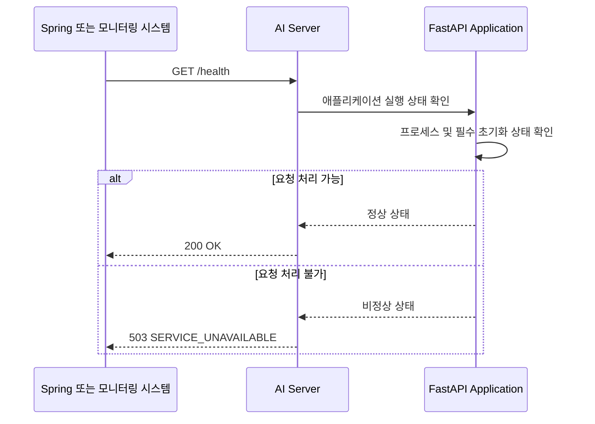
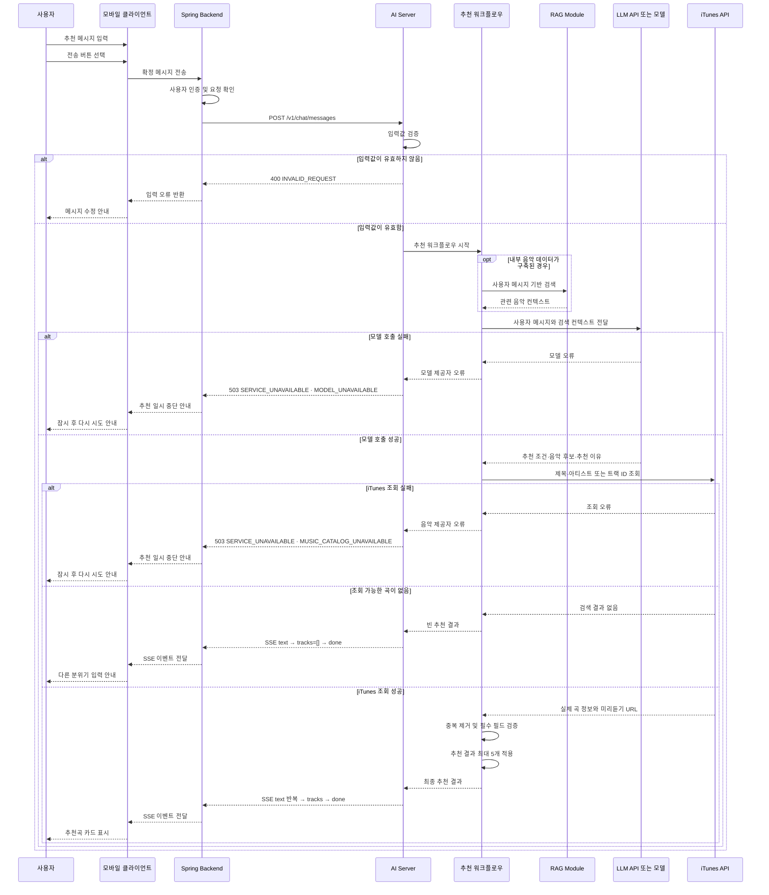
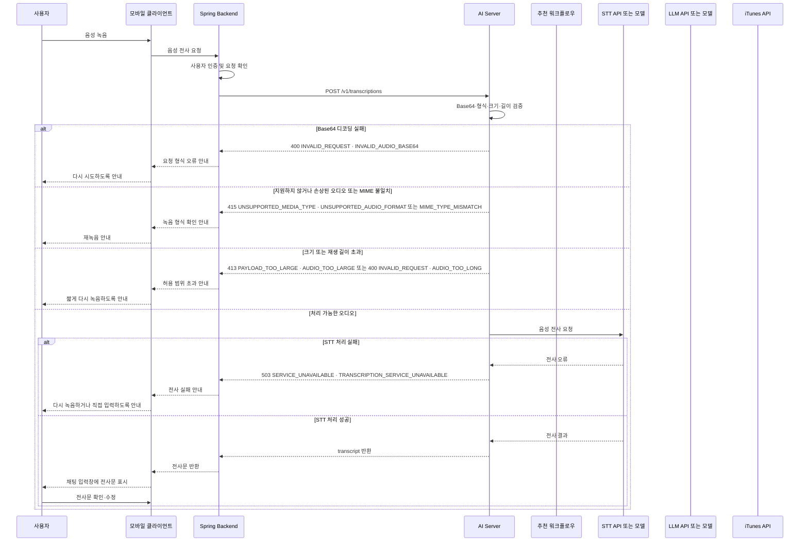
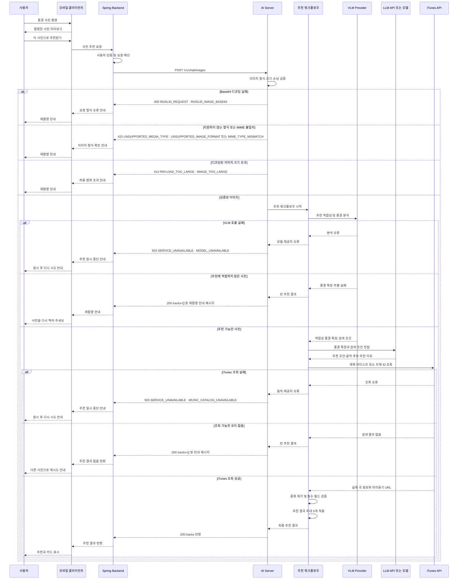
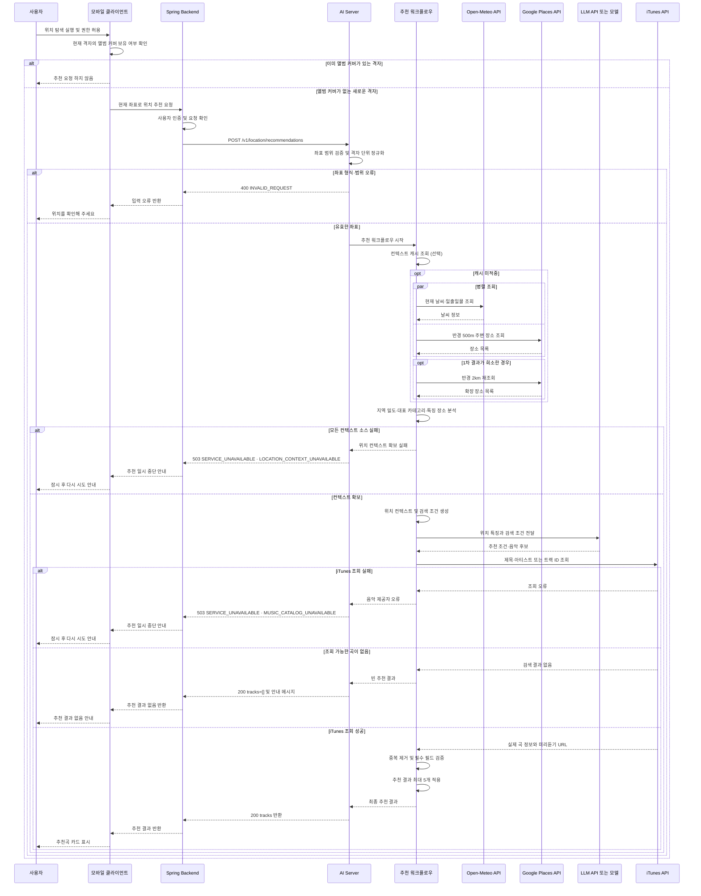

# 모델 API 설계

> [모델 API 설계 시트](https://docs.google.com/spreadsheets/d/1NRPGWvaZ_pHjUXt748-iBMnRgkhdlUHfoJDnX1DPWz0/edit?gid=1878554884#gid=1878554884)

이 문서는 Spring Backend와 AI Server 사이의 API 계약을 정의한다. 구현과 협업 시에는 엔드포인트, 필수·선택 필드, 검증 규칙, 성공·오류 응답을 먼저 확인한다.

> API 계약은 코드와 OpenAPI를 최종 기준으로 관리한다. 계약이 변경되면 팀원과 함께 위키 페이지를 갱신한다.

## 기능별 처리 흐름 프리뷰

<details>
<summary><strong>1. AI 서버 상태 확인 — 시퀀스 다이어그램과 설계 이유</strong></summary>

### AI 서버 상태 확인

Spring 서버, 컨테이너 플랫폼 또는 모니터링 시스템이 AI 서버의 기본 실행 상태를 확인한다. 헬스체크에서는 비용과 지연이 발생하는 LLM, STT, VLM 및 iTunes API를 호출하지 않는다.



### 설계 이유

- AI 서버가 HTTP 요청을 받을 수 있는지 빠르게 확인한다.
- 반복되는 헬스체크에서 외부 유료 API를 호출하지 않는다.
- 외부 AI 모델이나 iTunes의 일시적인 장애를 AI 서버 프로세스 장애와 구분한다.
- 컨테이너 재시작과 배포 상태 판단에 사용할 수 있도록 응답을 단순하게 유지한다.
- 외부 의존성 점검이 필요해지면 `/health`에 포함하지 않고 별도의 readiness 엔드포인트를 검토한다.

</details>

<details>
<summary><strong>2. 텍스트 음악 추천 — 시퀀스 다이어그램과 설계 이유</strong></summary>

### 텍스트 음악 추천

사용자가 전송을 확정한 텍스트를 기반으로 음악 추천을 실행한다. AI 서버는 추천 조건과 음악 후보를 생성하고, iTunes에서 실제 제공되는 곡인지 확인한 뒤 정제된 추천 결과를 반환한다.



### 설계 이유

- 사용자가 전송을 확정한 메시지만 추천에 사용한다.
- 모델이 생성한 곡을 그대로 반환하지 않고 iTunes에서 실제 곡 정보를 확인한다.
- 음악 제목, 아티스트, 앨범 이미지와 미리듣기 URL을 정규화하여 반환한다.
- 챗봇 안내 문장은 `text` 이벤트로 스트리밍하고, 추천곡 카드는 검증이 끝난 배열을 `tracks` 이벤트로 한 번만 반환한다.
- 검색 결과가 없는 경우는 장애가 아니므로 `200`과 빈 목록, 안내 메시지로 처리한다.
- RAG는 내부 음악 데이터가 구축되고 도입 효과가 확인된 경우에만 실행한다.

</details>

<details>
<summary><strong>3. 음성 전사 — 시퀀스 다이어그램과 설계 이유</strong></summary>

### 음성 전사

음성을 텍스트 초안으로 변환하여 채팅 입력창에 표시한다. 사용자가 전사문을 확인·수정한 뒤 전송하면 기존 텍스트 음악 추천 API를 실행한다.



### 설계 이유

- 음성 인식 결과를 바로 추천에 사용하지 않고 채팅 입력창에 초안으로 표시한다.
- 사용자가 잘못 인식된 내용을 수정한 뒤 전송할 수 있게 한다.
- 확정된 전사문은 별도 음성 추천 API가 아니라 `/v1/chat/messages`로 전달한다.
- 사용자가 확정한 전사문은 텍스트 입력과 동일한 추천 워크플로우와 응답 형식을 사용한다.
- 오디오 검증, 음성 전사, 음악 추천의 실패 지점을 구분한다.

</details>

<details>
<summary><strong>4. 사진 음악 추천 — 시퀀스 다이어그램과 설계 이유</strong></summary>

### 사진 음악 추천

사용자가 촬영한 풍경 사진을 검증하고, VLM으로 추천 적합성과 풍경 특징을 분석한다. 추천 가능한 사진이면 분석 결과를 실제 음악 검색과 추천 생성 과정에 연결한다.



### 내부 처리 순서

```text
이미지 검증
→ VLM 추천 적합성 판정 및 풍경 특징 추출
→ 음악 검색 조건 생성
→ iTunes 음악 검색
→ 최종 순위 및 추천 이유 생성
→ 응답 검증 및 정제
```

### 설계 이유

- 파일 형식, 크기와 손상 여부는 VLM 호출 전에 검사하여 불필요한 모델 비용을 줄인다.
- 사진 적합성 판정과 풍경 특징 추출은 한 번의 VLM 호출에서 처리한다.
- 추천에 적합하지 않은 사진은 음악 검색과 추가 모델 호출을 실행하지 않는다.
- 모델이 생성한 곡을 그대로 반환하지 않고 iTunes에서 실제 음악 정보를 확인한다.
- 추천 이유 생성 방식은 품질과 비용을 측정한 뒤 모델 생성 또는 문장 템플릿으로 결정한다.

### 모델 호출 횟수

VLM 하나가 이미지 분석과 한국어 생성을 모두 담당할 수는 있다. 그러나 음악 검색 전에는 실제 곡 정보가 없으므로, 모델 종류를 하나로 통합하더라도 추론이 반드시 한 번으로 줄어들지는 않는다.

기본 흐름은 다음 두 가지 방식 중 성능과 비용을 비교하여 결정한다.

1. **단일 모델 호출:** VLM이 풍경 특징과 검색 조건을 생성하고, 추천 이유는 문장 템플릿으로 만든다.
2. **두 번의 모델 호출:** VLM으로 풍경을 분석한 뒤 실제 음악 후보를 검색하고, 모델을 다시 호출하여 곡별 추천 이유와 순위를 생성한다.

MVP에서는 단일 호출과 문장 템플릿을 우선 검토하고, 추천 이유의 품질이 부족할 때 두 번째 모델 호출을 적용한다.

</details>

<details>
<summary><strong>5. 위치 음악 추천 — 시퀀스 다이어그램과 설계 이유</strong></summary>

### 위치 음악 추천

> 제품 V3에서 적용할 기능이다. `/v1`은 제품 버전이 아니라 API 계약 버전을 의미하므로 첫 번째 위치 추천 API는 `/v1/location/recommendations`로 정의한다.

사용자의 현재 위치를 격자 단위로 변환하고, 날씨와 주변 장소 정보를 조합하여 해당 공간에 어울리는 음악을 추천한다. 이미 추천 결과가 등록된 격자는 기존 결과를 재사용한다.

### 위치 추천 흐름



### 내부 처리 순서

```text
좌표 검증
→ 격자 단위 정규화
→ 컨텍스트 캐시 조회
→ 날씨·주변 장소 조회
→ 위치 특징 및 음악 검색 조건 생성
→ iTunes 음악 검색
→ 추천 이유 생성
→ 응답 검증 및 정제
```

### 설계 이유

- 격자 판정과 10분 주기 위치 확인은 클라이언트에서 수행하고, AI 서버는 추천이 필요하다고 판단된 좌표만 처리한다.
- 주변 장소는 좁은 반경을 먼저 조회하고 결과가 희소한 경우에만 반경을 확장하여 외부 API 호출 횟수를 제한한다.
- 날씨와 장소 정보는 서로 의존하지 않으므로 병렬로 조회하여 응답 지연을 줄인다.
- 한쪽 컨텍스트만 확보해도 추천을 계속하고, 모든 컨텍스트를 확보하지 못한 경우에만 실패로 처리한다.
- 모델이 생성한 곡을 그대로 반환하지 않고 iTunes에서 실제 곡 정보를 확인한다.

### 위치 정보 처리 원칙

- 사용자가 위치 탐색을 시작하고 권한을 허용한 경우에만 현재 좌표를 수집하며 백그라운드 수집은 하지 않는다.
- 정확한 좌표는 날씨와 장소 조회에만 사용하고 추천 생성 모델에는 전달하지 않는다.
- 추천 생성 모델에는 날씨, 시간대, 지역 밀도와 대표 장소 유형처럼 정규화된 특징만 전달한다.
- AI 서버는 좌표를 저장하지 않고 요청을 처리하는 동안에만 사용하며, 로그에는 격자 단위로 낮춘 값만 남긴다.
- 사용자별 격자 추천 결과는 Spring이 격자 단위로 저장하며, 정확한 좌표는 기록에 포함하지 않는다.

</details>

---


## API 계약 한눈에 보기

| 제품 범위 | API | 역할 | 필수 요청값 | 선택 요청값 | 성공 응답 |
|---|---|---|---|---|---|
| V1~V3 | `GET /health` | AI 서버 실행 상태 확인 | 없음 | 없음 | `status` |
| V1 | `POST /v1/chat/messages` | 확정 텍스트 기반 음악 추천 | `thread_id`<br>`request_id`<br>`message` | `user_context` | SSE `text`<br>`tracks`<br>`done` 또는 `error` |
| V1 | `POST /v1/transcriptions` | 음성을 수정 가능한 텍스트 초안으로 변환 | `audio_base64`<br>`mime_type` | 없음 | `transcript` |
| V2 | `POST /v1/chat/images` | 풍경 사진 기반 음악 추천 | `thread_id`<br>`request_id`<br>`image_base64`<br>`mime_type` | `user_context` | `message`<br>`tracks` |
| V3 | `POST /v1/location/recommendations` | 위치·날씨·주변 장소 기반 음악 추천 | `latitude`<br>`longitude` | `user_context` | `message`<br>`tracks` |

`V1~V3`은 서비스 기능의 출시 범위이고, 엔드포인트의 `/v1`은 API 계약 버전이다. 따라서 제품 V2와 V3에서 기능이 추가되더라도 각 기능의 첫 번째 API 명세는 `/v1`으로 시작한다.

음성 입력은 음성 자체로 음악을 추천하는 기능이 아니다. STT 결과를 채팅 입력창에 표시한 뒤 사용자가 수정·확정하면 텍스트 음악 추천 API를 호출한다.

사진과 위치 입력은 사용자 확인 이후 각각의 추천 API를 호출한다. 실제 음악 정보 조회와 최종 응답 정제는 텍스트 추천과 동일한 공통 추천 모듈을 사용한다.


---


## 핵심 API 설계

### 공통 설계 원칙

| 구분 | 설계 원칙 |
|---|---|
| 호출 방향 | 모바일 클라이언트는 AI Server를 직접 호출하지 않으며, 모든 요청은 `Client → Spring Backend → AI Server` 순서로 전달한다. |
| 인증·인가 | 사용자 인증과 서비스 접근 권한 검사는 Spring Backend가 담당한다. AI Server는 전달받은 입력의 형식과 처리 가능 여부를 검증한다. |
| AI Server 책임 | 입력 검증, 모델 호출, 음악 검색, 응답 검증과 정제를 담당한다. |
| 대화 맥락 | 텍스트와 사진 추천은 `thread_id`로 현재 채팅 맥락을 구분한다. 음성 전사와 위치 추천은 대화 맥락을 사용하지 않는다. |
| 중복 처리 | 텍스트와 사진 추천은 요청마다 발급한 `request_id`로 재시도와 중복 요청을 식별한다. |
| 사용자 확정 | 음성 전사 결과는 추천 입력이 아닌 수정 가능한 초안이다. 사용자가 확인·수정한 뒤 `/v1/chat/messages`로 전송해야 추천을 실행한다. |
| 외부 결과 검증 | 외부 모델과 iTunes의 응답은 신뢰하지 않는다. iTunes에서 실제 곡 정보와 링크를 확인하고, 응답 스키마의 필수 필드와 형식을 검증한다. |
| 실패 처리 | 입력 오류, 미디어 오류, 모델 장애, 음악 카탈로그 장애를 구분한다. SSE 시작 전 오류는 HTTP 오류 응답으로, 시작 후 오류는 `error` 이벤트로 반환한다. 추천 결과가 없는 경우는 `tracks: []` 이벤트로 반환한다. |
| 응답 계약 | V1 텍스트 추천은 안내 문장을 `text` 이벤트로 스트리밍하고, 완성된 추천곡 배열을 `tracks` 이벤트로 한 번 반환한다. 음성 전사는 수정 가능한 `transcript` 초안을 반환한다. |
| 버전 | 제품 범위 V1·V2·V3와 API 계약 버전 `/v1`은 서로 다른 개념이다. 새 제품 기능의 첫 계약도 `/v1`에서 시작할 수 있다. |

## 공통 데이터 계약

### 표기 규칙

| 표기 | 의미 |
|---|---|
| 필수 | 요청에는 반드시 포함하고, 성공 응답에는 항상 반환한다. |
| 선택 | 요청에서 생략할 수 있다. 값이 제공되면 각 필드의 타입과 제약을 지켜야 한다. |
| nullable | 응답 필드는 항상 반환하지만, 값이 없을 때는 `null`을 반환할 수 있다. |

### `user_context` 요청 객체

`user_context`는 추천 품질을 보조하는 선택 객체다. 객체 전체와 내부 필드를 모두 생략할 수 있다. 현재 명세에 정의되지 않은 값의 범위와 열거형은 OpenAPI 확정 전까지 임의로 가정하지 않는다.

| 필드 | 타입 | 필수 여부 | 처리 원칙 |
|---|---|---|---|
| `age` | integer | 선택 | 직접 추천 기준이 아니라 명백히 부적합한 곡을 제외하는 보조 정보로 사용한다. |
| `gender` | string | 선택 | 개인화 보조 정보로만 사용한다. |
| `preferred_genres` | array&lt;string&gt; | 선택 | 선호 장르 목록이며 추천 후보 생성과 정렬에 활용한다. |

### 음악 추천 SSE 응답

V1 텍스트 추천은 `200 OK` 연결을 유지하면서 다음 이벤트를 순서대로 반환한다. `text`는 여러 번 올 수 있고, `tracks`와 `done`은 정상 응답에서 한 번만 온다.

| 이벤트 | `data` 필드 | 설명 |
|---|---|---|
| `text` | `delta: string` | 화면에 이어 붙일 추천 안내 문장 조각 |
| `tracks` | `tracks: array<track>` | 검증과 정제가 끝난 추천곡 전체 목록. 최소 0개, 최대 5개 |
| `done` | 빈 객체 | 정상 스트림 종료 |
| `error` | `detail: string` | 스트리밍 시작 후 발생한 오류 |

#### `track` 객체

| 필드 | 타입 | 필수 여부 | 설명 |
|---|---|---|---|
| `title` | string | 필수 | iTunes가 반환한 곡 제목 원문 |
| `artist` | string | 필수 | iTunes가 반환한 아티스트명 원문. 단일 문자열 |
| `track_id` | string | 필수 | iTunes 트랙 ID를 숫자 문자열로 반환 |
| `preview_url` | string 또는 null | 필수 | 미리듣기 URL. 제공되지 않으면 `null` |
| `artwork_url` | string 또는 null | 필수 | HTTPS 앨범 이미지 URL. 제공 시 600×600 규격 사용 |
| `store_url` | string | 필수 | 곡 상세 페이지로 연결되는 HTTPS URL |
| `reason` | string | 필수 | 현재 입력·맥락과 해당 곡이 어울리는 이유 |

```text
event: text
data: {"delta":"현재 분위기에 "}

event: text
data: {"delta":"어울리는 곡을 골라봤어요."}

event: tracks
data: {"tracks":[{"title":"노을","artist":"카더가든","track_id":"1234567890","preview_url":"https://audio-ssl.itunes.apple.com/itunes-assets/AudioPreview/example1.m4a","artwork_url":"https://is1-ssl.mzstatic.com/image/thumb/Music/example1/600x600bb.jpg","store_url":"https://music.apple.com/kr/album/example1?i=1234567890","reason":"해질녘의 따뜻한 색감과 잔잔한 기타 사운드가 잘 어울려요."}]}

event: done
data: {}
```

추천 가능한 곡이 없으면 오류 대신 안내 문장과 빈 추천곡 배열을 반환한다.

```text
event: text
data: {"delta":"조건에 맞는 곡을 찾지 못했어요. 다른 분위기로 다시 요청해 주세요."}

event: tracks
data: {"tracks":[]}

event: done
data: {}
```

### 공통 오류 응답

| 필드 | 타입 | 필수 여부 | 설명 |
|---|---|---|---|
| `code` | string | 필수 | 클라이언트 분기용 상위 오류 코드 |
| `message` | string | 필수 | 사용자에게 전달할 수 있는 오류 안내 문구 |
| `details` | object 또는 null | 필수 | 세부 원인과 제한값. 추가 정보가 없으면 `null` |
| `details.reason` | string | 조건부 필수 | 하나의 상태 코드 안에서 실패 원인을 구분할 때 사용 |
| `details.max_decoded_bytes` | integer | 조건부 필수 | 디코딩된 파일 크기 제한을 초과했을 때 허용 최대 바이트 수 |

```json
{
  "code": "SERVICE_UNAVAILABLE",
  "message": "일시적으로 AI 기능을 사용할 수 없습니다.",
  "details": {
    "reason": "MODEL_UNAVAILABLE"
  }
}
```

---

## API별 요청·응답 계약

### 1. AI 서버 상태 확인

`GET /health`

Spring Backend, 배포 플랫폼 또는 모니터링 시스템이 FastAPI 프로세스와 필수 모듈 초기화 상태를 확인한다. 반복 호출에 비용과 지연이 생기지 않도록 LLM, STT, VLM, iTunes API는 호출하지 않는다.

#### 요청

요청 본문과 필수 파라미터가 없다.

#### 응답

| HTTP | 응답 | 의미 |
|---|---|---|
| `200` | `{ "status": "ok" }` | HTTP 요청을 처리할 수 있음 |
| `503` | 공통 오류 응답, `code: SERVICE_UNAVAILABLE` | 필수 초기화가 완료되지 않아 요청을 처리할 수 없음 |

`200 OK` 응답 필드는 다음과 같다.

| 필드 | 타입 | 필수 여부 | 설명 |
|---|---|---|---|
| `status` | string | 필수 | 정상 상태에서는 `ok` |

### 2. 텍스트 음악 추천

`POST /v1/chat/messages`

사용자가 전송을 확정한 텍스트와 현재 채팅 맥락을 처리하여 실제 조회 가능한 음악을 최대 5곡 추천한다. 직접 입력한 텍스트와 사용자가 확인·수정한 STT 전사문은 모두 같은 `message`로 처리한다.

#### 요청 필드

| 필드 | 타입·제약 | 필수 여부 | 처리 방식 |
|---|---|---|---|
| `thread_id` | string(UUID) | 필수 | 채팅방 진입 시 한 번 발급하고 같은 채팅 세션 동안 유지한다. |
| `request_id` | string(UUID) | 필수 | 사용자 요청마다 새로 발급하며 중복 처리를 방지한다. |
| `message` | string, 1~200자 | 필수 | 사용자가 전송을 확정한 추천 요청 문장 |
| `user_context` | object | 선택 | 나이·성별·선호 장르를 포함하는 개인화 보조 정보 |

#### 성공 응답

`200 OK`와 `text/event-stream`으로 응답한다. 안내 문장은 `text` 이벤트로 스트리밍하고, 검증이 끝난 전체 추천곡은 `tracks` 이벤트로 한 번 반환한 뒤 `done`으로 종료한다.

#### 오류 응답

| HTTP | `code` | `details.reason` | 발생 조건 |
|---|---|---|---|
| `400` | `INVALID_REQUEST` | 없음 | UUID 형식, 메시지 길이 등 요청값이 계약에 맞지 않음 |
| `503` | `SERVICE_UNAVAILABLE` | `MODEL_UNAVAILABLE` | 모델 제공자를 호출할 수 없음 |
| `503` | `SERVICE_UNAVAILABLE` | `MUSIC_CATALOG_UNAVAILABLE` | iTunes 음악 조회를 사용할 수 없음 |

SSE 응답을 시작하기 전에 발생한 오류는 위 HTTP 오류 응답을 사용한다. `text` 이벤트를 전송한 뒤 발생한 오류는 HTTP 상태를 변경할 수 없으므로 `error` 이벤트를 보내고 스트림을 종료한다.

### 3. 음성 전사

`POST /v1/transcriptions`

음성 파일을 수정 가능한 텍스트 초안으로 변환한다. 이 API는 음악 추천, 채팅 메시지 전송, 대화 저장을 수행하지 않는다.

#### 요청 필드

| 필드 | 타입·제약 | 필수 여부 | 처리 방식 |
|---|---|---|---|
| `audio_base64` | string(Base64) | 필수 | `data:audio/...;base64,` 접두어가 없는 순수 Base64 문자열 |
| `mime_type` | string | 필수 | `audio/webm`, `audio/mp4`, `audio/mpeg`, `audio/wav` 중 하나 |

#### 서버 검증

| 검증 항목 | 허용 기준 | 실패 응답 |
|---|---|---|
| Base64 | 정상적으로 디코딩 가능 | `400 INVALID_AUDIO_BASE64` |
| 파일 크기 | 디코딩 후 10MB 이하 | `413 AUDIO_TOO_LARGE` |
| 재생 길이 | 30초 이하 | `400 AUDIO_TOO_LONG` |
| 파일 형식 | 파일 시그니처와 `mime_type` 일치 | `415 MIME_TYPE_MISMATCH` |
| 디코딩 | FFmpeg로 손상 없이 디코딩 가능 | `415 UNSUPPORTED_AUDIO_FORMAT` |

#### 성공 응답

| 필드 | 타입 | 필수 여부 | 설명 |
|---|---|---|---|
| `transcript` | string | 필수 | 사용자가 수정한 뒤 텍스트 추천 요청으로 전송할 수 있는 전사 초안 |

#### 오류 응답

| HTTP | `code` | `details.reason` |
|---|---|---|
| `400` | `INVALID_REQUEST` | `INVALID_AUDIO_BASE64`, `AUDIO_TOO_LONG` |
| `413` | `PAYLOAD_TOO_LARGE` | `AUDIO_TOO_LARGE` |
| `415` | `UNSUPPORTED_MEDIA_TYPE` | `MIME_TYPE_MISMATCH`, `UNSUPPORTED_AUDIO_FORMAT` |
| `503` | `SERVICE_UNAVAILABLE` | `TRANSCRIPTION_SERVICE_UNAVAILABLE` |

### 4. 사진 음악 추천

`POST /v1/chat/images` · 제품 V2 예정

사용자가 전송을 확정한 사진을 VLM으로 분석하여 장면·분위기 태그를 추출하고, 현재 채팅 맥락과 결합해 음악을 추천한다. 텍스트 전사 단계는 없다.

#### 요청 필드

| 필드 | 타입·제약 | 필수 여부 | 처리 방식 |
|---|---|---|---|
| `thread_id` | string(UUID) | 필수 | 현재 채팅 세션 식별자 |
| `request_id` | string(UUID) | 필수 | 요청별 중복 처리 방지 식별자 |
| `image_base64` | string(Base64) | 필수 | `data:image/...;base64,` 접두어가 없는 순수 Base64 문자열 |
| `mime_type` | string | 필수 | `image/jpeg`, `image/png`, `image/webp` 중 하나 |
| `user_context` | object | 선택 | 나이·성별·선호 장르를 포함하는 개인화 보조 정보 |

#### 이미지 처리 기준

| 구간 | 기준 |
|---|---|
| 클라이언트 | 전송 전에 이미지의 긴 변을 1024px 이하로 축소한다. |
| AI Server | Base64 디코딩 후 실제 파일 크기가 5MB 이하인지 검사한다. |
| AI Server | 파일 시그니처, MIME 타입, 이미지 손상 여부를 검사한 뒤 VLM을 호출한다. |

#### 성공 응답

제품 V2 구현 전에 응답 전송 방식을 확정한다. 추천곡 데이터는 위에서 정의한 공통 `track` 객체를 따른다.

#### 오류 응답

| HTTP | `code` | `details.reason` |
|---|---|---|
| `400` | `INVALID_REQUEST` | `INVALID_IMAGE_BASE64` |
| `413` | `PAYLOAD_TOO_LARGE` | `IMAGE_TOO_LARGE` |
| `415` | `UNSUPPORTED_MEDIA_TYPE` | `MIME_TYPE_MISMATCH`, `UNSUPPORTED_IMAGE_FORMAT` |
| `503` | `SERVICE_UNAVAILABLE` | `MODEL_UNAVAILABLE`, `MUSIC_CATALOG_UNAVAILABLE` |

### 5. 위치 음악 추천

`POST /v1/location/recommendations` · 제품 V3 예정

사용자가 위치 탐색을 명시적으로 실행하고 권한을 허용한 경우에만 현재 좌표를 날씨·시간대·주변 장소 맥락으로 변환하여 추천한다. 채팅이나 `thread_id`를 사용하지 않는 독립적인 무상태 요청이며, 백그라운드 위치 수집과 위치 이력 저장은 하지 않는다.

#### 요청 필드

| 필드 | 타입·제약 | 필수 여부 | 처리 방식 |
|---|---|---|---|
| `latitude` | number, -90~90 | 필수 | 현재 위치의 위도 |
| `longitude` | number, -180~180 | 필수 | 현재 위치의 경도 |
| `user_context` | object | 선택 | 나이·성별·선호 장르를 포함하는 개인화 보조 정보 |

#### 위치 정보 처리 원칙

| 단계 | 처리 원칙 |
|---|---|
| 수집 | 사용자가 탐색을 시작하고 위치 권한을 허용했을 때만 수집한다. |
| 외부 조회 | 정확한 좌표는 날씨와 주변 장소 조회에만 사용한다. |
| 모델 입력 | 정확한 좌표 대신 날씨, 시간대, 지역 밀도, 대표 장소 유형 등 정규화된 특징을 전달한다. |
| 저장·로그 | AI Server는 정확한 좌표와 위치 이력을 저장하지 않으며, 로그에는 격자 단위로 낮춘 값만 남긴다. |

#### 성공 응답

제품 V3 구현 전에 응답 전송 방식을 확정한다. 추천곡 데이터는 위에서 정의한 공통 `track` 객체를 따른다.

#### 오류 응답

| HTTP | `code` | `details.reason` |
|---|---|---|
| `400` | `INVALID_REQUEST` | 없음 |
| `503` | `SERVICE_UNAVAILABLE` | `LOCATION_CONTEXT_UNAVAILABLE`, `MUSIC_CATALOG_UNAVAILABLE` |

---
