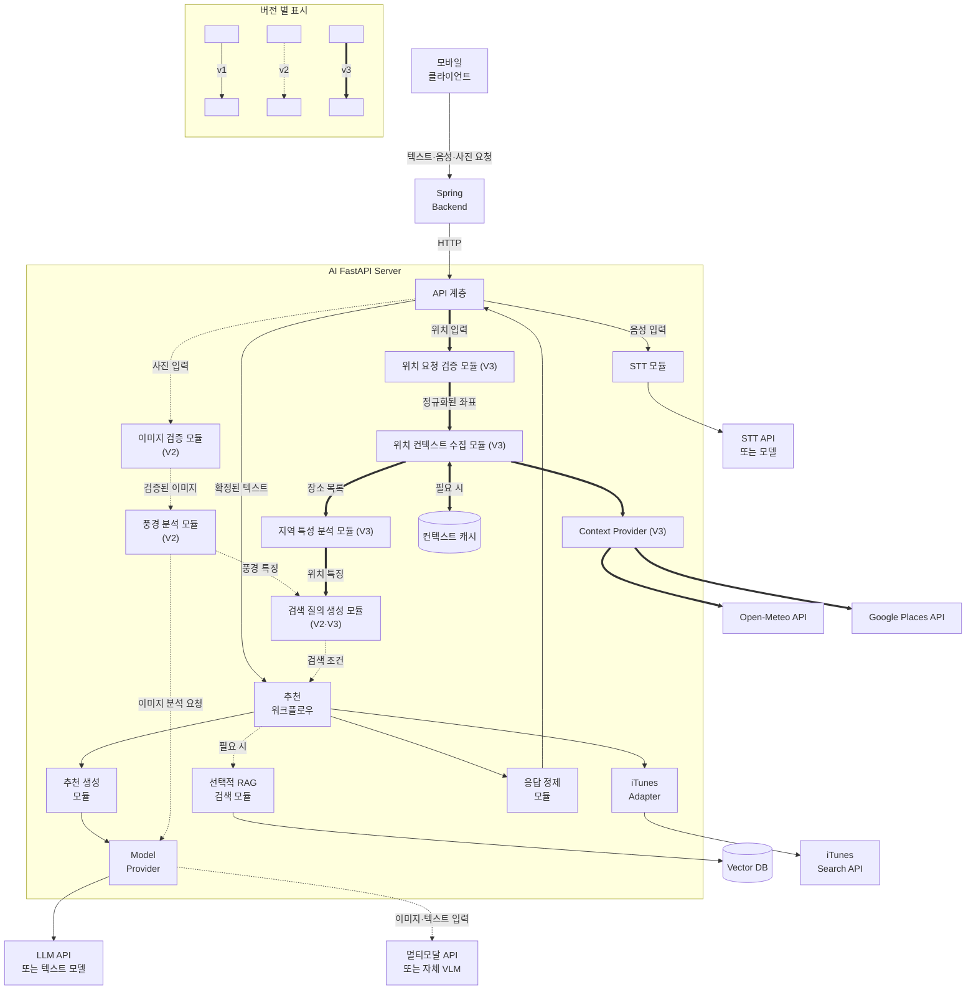
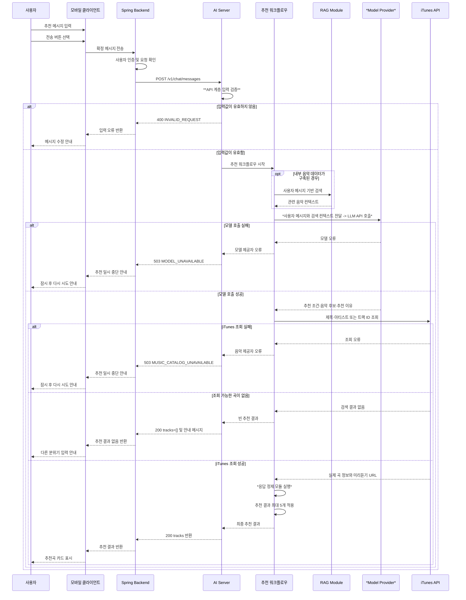
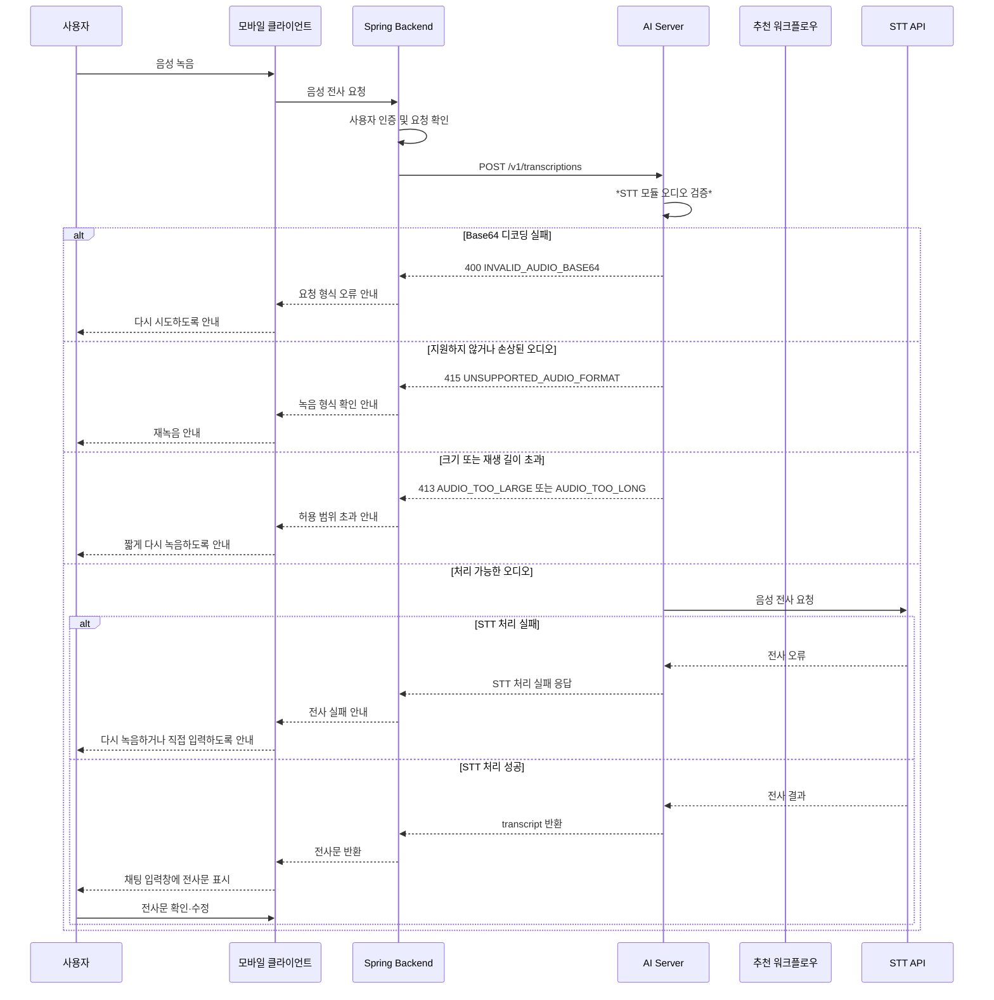
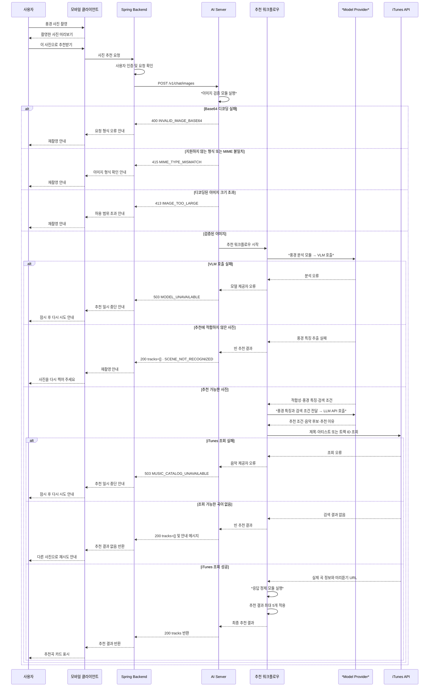
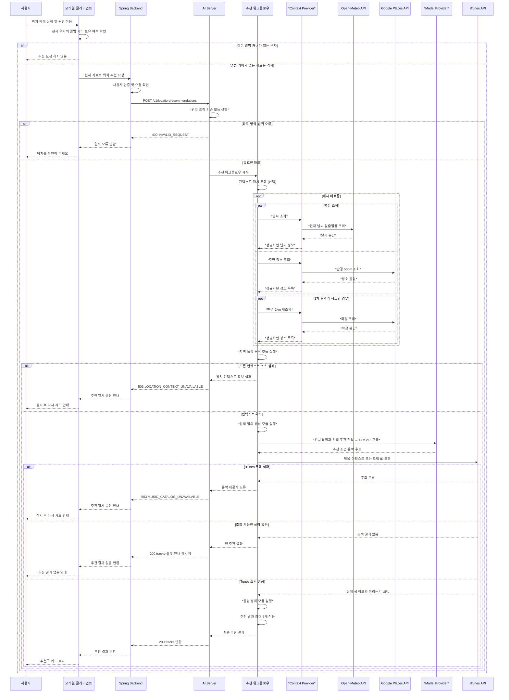

# 서비스 아키텍처 모듈화

## 설계 목적

머문음은 사용자의 텍스트, 음성 또는 풍경 사진을 바탕으로 상황과 분위기에 어울리는 음악을 추천한다.

Spring 서버가 인증과 서비스 흐름을 담당하고, AI 서버는 음성 전사, 풍경 분석과 음악 추천을 전담하도록 배포 경계를 분리한다. AI 서버 내부에서는 STT, 이미지 검증, 풍경 분석, 추천 워크플로우, 선택적 RAG, 음악 정보 조회를 독립된 모듈로 구성하여 모델이나 외부 서비스가 변경되더라도 전체 시스템에 미치는 영향을 줄인다.

V1에서는 텍스트·음성 기반 추천을 제공한다. V2에서는 풍경 사진 입력을 추가하되, V1의 음악 검색, 추천 생성과 응답 정제 모듈을 재사용한다. V3에서는 사용자가 앨범 커버가 등록되지 않은 새로운 격자에 진입했을 때, 현재 좌표를 위치 맥락으로 변환하여 음악을 추천한다.  

> V2의 모델, 이미지 전송 방식과 저장 정책은 기술 검증 및 팀 회의 후 확정한다. 본 문서에서는 기능 확장에 필요한 모듈 경계와 처리 흐름을 우선 정의한다.

> V3의 반경 임계치, 장소 카테고리 목록과 캐시 정책은 실제 호출 비용 측정 후 조정한다. 본 문서에서는 모듈 경계와 처리 흐름, 초기 기준값을 정의한다.

---

## 1. 모듈화 적용 후 서비스 아키텍처



### 주요 경계

- 모바일 클라이언트는 AI 서버를 직접 호출하지 않고 Spring 서버를 서비스 진입점으로 사용한다.
- Spring 서버는 사용자 인증, 요청 제어 및 클라이언트 응답 전달을 담당한다.
- AI 서버는 음성 전사, 풍경 분석과 음악 추천 워크플로우를 독립적으로 실행한다.
- LangGraph를 사용할 경우 추천 처리 순서와 조건 분기를 관리하는 워크플로우 구현체로 제한한다.
- RAG는 내부 음악 데이터가 확보되고 검색 효과가 검증된 경우에만 사용하는 선택 모듈로 둔다.
- STT, LLM, VLM, Vector DB 및 iTunes는 전용 인터페이스를 통해 연결한다.
- 외부 멀티모달 API와 자체 VLM은 동일한 Model Provider 인터페이스로 연결한다.
- AI 서버 내부 기능은 독립된 코드 모듈로 구성하되, 각각을 별도 마이크로서비스로 배포하지 않는다.

### V1 처리 범위

```text
텍스트 입력
→ 추천 워크플로우
→ 필요 시 RAG 검색
→ 추천 후보 또는 검색 조건 생성
→ iTunes 음악 정보 조회
→ 결과 검증 및 정제
→ 추천 결과 반환
```

```text
음성 입력
→ STT 처리
→ 전사문 반환
→ 사용자 확인·수정
→ 확정된 텍스트 전송
→ 기존 텍스트 추천 흐름 실행
```

### V2 처리 범위

```text
사진 입력
→ 이미지 기술 검증
→ VLM 기반 추천 적합성 판정 및 풍경 특징 추출
├─ 추천 부적합: 재촬영 안내
└─ 추천 적합
   → 음악 검색 조건 생성
   → 기존 V1 음악 검색·추천 흐름 실행
   → 추천 결과 반환
```

사진 적합성 판정과 풍경 특징 추출은 별도의 모델 호출로 나누지 않고 한 번의 VLM 호출에서 처리한다.

### V3 처리 범위

```
좌표 입력
→ 좌표 형식, 범위 검증 및 격자 단위 정규화
→ 필요 시 캐시 조회
├─ 캐시 적중: 저장된 위치 컨텍스트 사용
└─ 캐시 미적중
   → 날씨·주변 장소 병렬 조회
   → 지역 특성 분석 (밀도·대표 카테고리·특징 장소)
→ 위치 컨텍스트 구성 (시간대·계절 포함)
→ 음악 검색 조건 생성
→ 기존 V1 음악 검색·추천 흐름 실행
→ 추천 결과 반환
```

날씨 조회와 장소 조회는 서로 의존하지 않으므로 병렬로 실행한다.  
한쪽이 실패하면 실패한 소스를 제외한 컨텍스트로 검색 조건을 생성한다.  

### 배포 단위와 코드 단위

- Spring 서버와 AI 서버는 서로 독립적으로 배포한다.
- AI 서버는 AI 기능의 처리 부하에 맞춰 별도로 확장할 수 있다.
- AI 서버 내부 기능은 모듈 단위로 개발하고 테스트한다.
- 내부 모듈을 모두 마이크로서비스로 분리하지 않아 네트워크 복잡성과 운영 부담을 줄인다.
- 외부 API 기반 모델은 Provider 구현체로 연결한다.
- 자체 VLM을 도입할 경우 GPU 추론 서버만 FastAPI와 분리하여 배포할 수 있다.
- FastAPI 프로세스마다 모델을 중복 적재하지 않도록 자체 모델은 별도 추론 서버에서 관리한다.

---

## 2. 각 모듈의 책임과 분리 이유

| 모듈 | 적용 범위 | 책임 | 분리 이유 |
|---|---|---|---|
| API 계층 | V1·V2·V3 | 요청 검증, 서비스 호출, HTTP 응답 변환 | 외부 API 계약과 내부 구현을 분리한다. |
| STT 모듈 | V1 | 오디오 검증, FFmpeg 전처리, 음성 전사 | 추천 로직과 관계없이 STT 제공자를 교체하고 테스트할 수 있다. |
| 추천 워크플로우 | V1·V2·V3 | 추천 처리 순서, 조건 분기, 실패 처리 | 텍스트·음성·사진 추천의 공통 흐름을 한 곳에서 관리한다. |
| RAG 검색 모듈 | 선택 | 질문과 관련된 내부 음악 데이터 검색 | 검색 방식과 생성 모델의 결합을 줄인다. |
| 추천 생성 모듈 | V1·V2·V3 | 사용자 입력과 추천 컨텍스트를 분석하고 최종 추천 생성 | 추천 정책과 음악 정보 조회 책임을 분리한다. |
| iTunes Adapter | V1·V2·V3 | 추천 후보 검색, 상세 정보 조회, 외부 응답 변환 | 음악 제공자가 변경되어도 다른 모듈에 미치는 영향을 제한한다. |
| 응답 정제 모듈 | V1·V2·V3 | 중복 제거, 필수 필드 확인, URL 정규화 | 외부 데이터 품질과 API 응답 형식을 일관되게 유지한다. |
| 이미지 검증 모듈 | V2 | 이미지 형식, 용량, 해상도, 손상 여부 확인 | 기술적으로 처리할 수 없는 이미지를 VLM 호출 전에 차단한다. |
| 풍경 분석 모듈 | V2 | 추천 적합성 판정, 풍경 특징 추출 | 이미지 분석 모델과 음악 추천 정책을 분리한다. |
| 검색 질의 생성 모듈 | V2·V3 | 풍경 특징을 음악 검색 조건으로 변환 | VLM의 원본 응답이 음악 제공자 호출 방식에 직접 의존하지 않게 한다. |
| Model Provider | V1·V2·V3 | 외부 LLM·VLM API 또는 자체 모델 호출 | 모델 변경이 추천 워크플로우와 외부 API 계약에 직접 영향을 주지 않게 한다. |
| 공통 인프라 | V1·V2·V3 | 환경변수, 로깅, 예외 처리, 캐시 | 공통 기능의 중복 구현을 방지한다. |
| 위치 요청 검증 모듈 | V3 | 좌표 형식·범위 검증, 격자 단위 정규화, 캐시 키 생성 | 잘못된 좌표를 외부 API 호출 전에 차단한다. |
| 위치 컨텍스트 수집 모듈 | V3 | 날씨·주변 장소 병렬 조회, 캐시 관리, 부분 실패 처리 | 외부 컨텍스트 소스의 개수와 장애가 추천 로직에 직접 영향을 주지 않게 한다. |
| 지역 특성 분석 모듈 | V3 | 장소 목록을 밀도·대표 카테고리·특징 장소로 변환 | 장소 제공자의 원본 응답과 지역 해석 규칙을 분리한다. |
| Context Provider | V3 | 날씨·장소 등 외부 컨텍스트 API 호출 추상화 | 컨텍스트 제공자가 변경되어도 다른 모듈에 미치는 영향을 제한한다. |

### 이미지 검증과 풍경 분석의 구분

이미지 검증 모듈은 파일 자체를 검사한다.

- 지원하는 이미지 형식인지 확인한다.
- 파일 크기와 해상도를 확인한다.
- 이미지 디코딩이 가능한지 확인한다.
- 손상된 파일이나 빈 파일을 차단한다.
- 이미지 방향을 정규화한다.
- (V3) EXIF 정보 처리 정책을 적용한다.

풍경 분석 모듈은 이미지의 의미를 판단한다.

- 음악 추천에 사용할 수 있는 풍경인지 판단한다.
- 실내·실외를 분류한다.
- 낮·밤 또는 시간대 특성을 추출한다.
- 공원, 해안, 산, 도로 등 장소 유형을 추출한다.
- 사진에서 확인 가능한 날씨와 분위기를 추출한다.
- 음악 검색에 사용할 구조화된 컨텍스트를 생성한다.

### 내부 표준 스키마

내부 표준 스키마는 FastAPI 내부에서 API 계층 또는 컨텍스트 생성 모듈이 추천 워크플로우에 입력을 넘길 때 사용하는 모듈 간 데이터 계약이다. Spring과 FastAPI가 주고받는 외부 API 요청·응답 형식이 아니며, Spring이나 모바일에 그대로 노출하지 않는다. 외부 제공자의 응답 형식이 제각각이어도 이 형식으로 변환한 뒤 넘기므로, 제공자를 교체해도 뒤쪽 모듈은 수정하지 않는다.

| 버전 | 생성 모듈 | 사용 모듈 | 사용 시점 |
|---|---|---|---|
| V1 | API 계층 | 추천 워크플로우 | 텍스트 요청 검증 후 추천을 시작할 때 |
| V2 | 풍경 분석·검색 질의 생성 모듈 | 추천 워크플로우 | 이미지에서 추천 컨텍스트를 추출한 뒤 |
| V3 | 위치 컨텍스트 수집·검색 질의 생성 모듈 | 추천 워크플로우 | 위치·날씨·주변 장소를 추천 컨텍스트로 변환한 뒤 |

### V1 내부 표준 스키마

> API 계층이 검증한 텍스트와 선택적 사용자 컨텍스트를 추천 워크플로우에 넘기는 형식이다. 음성 입력도 사용자가 전사문을 확인·전송한 뒤에는 같은 형식을 사용한다.

```json
{
  "message": "비 오는 퇴근길에 듣기 좋은 잔잔한 음악을 추천해 줘",
  "user_context": {
    "age": 25,
    "gender": "male",
    "preferred_genres": ["ballad", "indie"]
  }
}
```

`message`는 사용자가 전송을 확정한 추천 요청 문장이다. `user_context`는 나이·성별·선호 장르를 포함할 수 있는 선택 객체이며, 객체 전체 또는 내부 필드를 생략할 수 있다. 추천 워크플로우는 `message`를 추천 생성과 선택적 RAG 검색 질의의 원문으로 사용한다.

V2와 V3는 `recommendable`, `reject_reason`, `search_query`를 공유한다. 입력 종류가 달라도 검색 질의 생성 모듈을 거쳐 동일한 추천 워크플로우로 합류하기 때문이다.

### V2 내부 표준 스키마

> 풍경 분석 모듈이 검색 질의 생성 모듈을 거쳐 추천 워크플로우에 넘기는 형식이다.

```json
{
  "recommendable": true,
  "reject_reason": null,
  "scene": {
    "environment": "outdoor",
    "place_type": "riverside_park",
    "time_of_day": "day",
    "weather": "sunny",
    "mood": [
      "peaceful",
      "refreshing"
    ]
  },
  "search_query": "햇살 좋은 낮의 강변 산책에 어울리는 편안하고 산뜻한 음악"
}
```

`recommendable`, `reject_reason`, `scene`은 풍경 분석 모듈이 판정하고 추출한 값이다. `search_query`는 검색 질의 생성 모듈이 `scene`을 음악 검색 조건으로 바꾼 값이다. 추천 워크플로우는 두 모듈을 거친 이 형태만 받는다. 이 형식을 고정하는 이유는 VLM 응답이 제공자마다 다르기 때문이다. 외부 멀티모달 API를 쓰든 자체 VLM을 쓰든 이 형태로 변환한 뒤 넘기므로, 모델을 교체해도 뒤쪽 모듈은 수정하지 않는다.


추천에 사용하기 어려운 사진은 다음처럼 표현한다.

```json
{
  "recommendable": false,
  "reject_reason": "SCENE_NOT_CLEAR",
  "scene": null,
  "search_query": null
}
```

`reject_reason`은 모델이 생성한 자연어를 그대로 외부에 반환하지 않는다. 내부 오류 코드로 변환한 뒤 모바일 화면에 맞는 안내 문구로 제공한다.

### V3 내부 표준 스키마

> 위치 컨텍스트 수집 모듈이 검색 질의 생성 모듈을 거쳐 추천 워크플로우에 넘기는 형식이다.

```json
{
  "recommendable": true,
  "reject_reason": null,
  "place_context": {
    "time_of_day": "evening",
    "season": "autumn",
    "weather": {
      "condition": "clear",
      "temperature_c": 18.2,
      "is_day": false
    },
    "area": {
      "density": "urban",
      "searched_radius_m": 500,
      "place_count": 20,
      "dominant_categories": ["cafe", "restaurant", "shopping"],
      "signature": ["coast"]
    },
    "mood": ["lively", "cool"]
  },
  "degraded_sources": [],
  "search_query": "해질녘 바다가 보이는 번화한 거리와 어울리는 선선하고 감성적인 음악"
}
```

필드별 생산 주체는 다음과 같다.

필드 | 생산 모듈
-- | --
`time_of_day`, `season` | 요청 시각과 좌표에서 계산한 값
`weather` | Context Provider가 날씨 API 응답을 정규화한 값
`area` | 지역 특성 분석 모듈이 장소 목록을 해석한 값
`mood` | 지역 특성 분석 모듈이 밀도·날씨·시간대를 종합한 값
`degraded_sources` | 위치 컨텍스트 수집 모듈이 기록한 실패 소스

`search_query`는 검색 질의 생성 모듈이 위 값들을 검색 조건으로 바꾼 값이다. 이 형식을 고정하는 이유는 컨텍스트 소스가 늘거나 바뀔 수 있기 때문이다. 장소 제공자를 교체하거나 소스를 추가해도 워크플로우는 이 형태만 받으므로 영향 범위가 Context Provider와 분석 모듈로 제한된다.

일부 소스만 확보한 경우에는 실패한 소스를 명시하고 나머지 정보로 검색 조건을 생성한다.

```json
{
  "recommendable": true,
  "reject_reason": null,
  "place_context": {
    "time_of_day": "night",
    "season": "autumn",
    "weather": null,
    "area": {
      "density": "rural",
      "searched_radius_m": 2000,
      "place_count": 12,
      "dominant_categories": ["restaurant", "lodging"],
      "signature": []
    },
    "mood": ["quiet"]
  },
  "degraded_sources": ["weather"],
  "search_query": "밤의 한적한 소도시에 어울리는 잔잔한 음악"
}
```

`degraded_sources`는 V3에만 둔다. V2는 컨텍스트 소스가 VLM 호출 한 번뿐이라 일부만 확보한 상태가 없다. 얻지 못하면 추천을 진행하지 않는다. 반면 V3는 날씨와 장소 두 소스를 쓰므로, 한쪽만 실패하면 나머지로 추천을 진행하고 어느 소스가 빠졌는지를 기록한다. 


두 소스가 모두 실패한 경우에만 추천을 중단한다.

```json
{
  "recommendable": false,
  "reject_reason": "LOCATION_CONTEXT_UNAVAILABLE",
  "place_context": null,
  "degraded_sources": ["weather", "places"],
  "search_query": null
}
```

`degraded_sources`는 내부 관측과 로그용 필드이며 외부 응답에 그대로 노출하지 않는다. `reject_reason`도 V2와 동일하게 내부 오류 코드로 변환한 뒤 안내 문구로 제공한다.

---

## 3. 모듈 간 인터페이스 설계

### 외부 인터페이스

| Method | Endpoint | 적용 범위 | 역할 | 통신 형식 | 상태 |
|---|---|---|---|---|---|
| POST | `/v1/transcriptions` | V1 | 음성을 채팅 입력창에 표시할 텍스트 초안으로 변환 | HTTP/JSON | 설계 완료 |
| POST | `/v1/chat/messages` | V1 | 사용자가 확정한 텍스트를 받아 음악 추천 실행 | HTTP/JSON | 설계 완료 |
| POST | `/v1/chat/images` | V2 | 풍경 사진을 분석하고 음악 추천 실행 | `multipart/form-data` 후보 | 검토 필요 |
| POST | /v1/location/recommendations | V3 | 현재 좌표를 위치 맥락으로 변환하여 음악 추천 실행 | HTTP/JSON | 설계 완료 |
| GET | `/health` | 공통 | AI 서버 실행 상태 확인 | HTTP/JSON | 설계 완료 |

제품 기능이 V2로 확장되더라도 기존 API와 호환되지 않는 변경이 없다면 API 경로는 `/v1`을 유지한다. API 요청·응답 계약을 호환되지 않게 변경할 때만 `/v2` 도입을 검토한다.

세부 요청 및 응답 필드는 [모델 API 설계](https://github.com/100-hours-a-week/KTB4-18th-wiki/wiki/%EB%AA%A8%EB%8D%B8-API-%EC%84%A4%EA%B3%84) 문서에서 관리한다.

### 텍스트 입력 내부 흐름

<details>
<summary>텍스트 입력 흐름</summary>



\*는 모듈화를 통해 수정된 내용이다

</details>

```text
API 계층
→ 입력 검증
→ 추천 워크플로우 시작
→ 필요한 경우 RAG 검색
→ 추천 조건 또는 후보 생성
→ iTunes 음악 정보 조회
→ 결과 검증 및 정제
→ API 응답 반환
```

### 음성 입력 내부 흐름

<details>
<summary>음성 입력 흐름</summary>


\*는 모듈화를 통해 수정된 내용이다

</details>

음성 인식 결과는 오류가 발생할 수 있으므로 바로 추천에 사용하지 않는다. 전사문을 입력창에 표시하여 사용자가 수정·확정하도록 하고, 확정된 텍스트만 일반 메시지 API로 전달한다.

이를 통해 텍스트와 음성 입력이 동일한 추천 흐름을 사용하며, STT 오류가 잘못된 음악 추천으로 직접 이어지는 것을 줄일 수 있다.

### 사진 추천 내부 흐름

<details>
<summary>사진 추천 흐름</summary>


\*는 모듈화를 통해 수정된 내용이다

</details>

사진 추천 요청은 이미지 분석과 음악 추천을 하나의 사용자 요청으로 처리한다. 내부적으로는 이미지 검증, 풍경 분석, 음악 검색과 추천 생성을 순서대로 실행한다.

VLM은 사진 적합성 판정과 풍경 특징 추출을 한 번의 추론으로 처리한다. 검색된 곡마다 자연스러운 추천 이유가 필요한 경우에는 동일 VLM 또는 별도 LLM을 한 번 더 호출할 수 있다.

모델을 한 종류만 사용하더라도 음악 검색 전후로 필요한 정보가 다르기 때문에 추론 횟수가 반드시 한 번으로 줄어드는 것은 아니다.

```text
API 계층
→ 이미지 기술 검증
→ 풍경 분석
→ 추천 적합성 분기
→ 검색 질의 생성
→ 기존 추천 워크플로우 연결
→ iTunes 음악 정보 조회
→ 필요한 경우 최종 추천 이유 생성
→ 결과 검증 및 정제
→ API 응답 반환
```

### 위치 추천 내부 흐름

<details>
<summary>위치 추천 흐름</summary>


\*는 모듈화를 통해 수정된 내용이다

</details>

위치 추천 요청은 컨텍스트 수집과 음악 추천을 하나의 사용자 요청으로 처리한다. 내부적으로는 좌표 검증, 컨텍스트 수집, 지역 분석, 음악 검색과 추천 생성을 순서대로 실행한다.  
10분 주기 확인과 격자 판정은 클라이언트에서 이루어지므로, 이미 앨범 커버가 있는 격자에서는 AI 서버 요청 자체가 발생하지 않는다. 외부 API 호출량은 사용자의 이동량이 아니라 새로운 격자 방문 횟수에 비례한다.  

```
API 계층
→ 좌표 형식·범위 검증
→ 격자 단위 정규화 및 캐시 키 생성 (선택)
→ 컨텍스트 캐시 조회
→ 캐시 미적중 시 날씨·주변 장소 병렬 조회
→ 필요한 경우 반경 확장 재조회
→ 지역 특성 분석
→ 위치 컨텍스트 구성
→ 검색 질의 생성
→ 기존 추천 워크플로우 연결
→ iTunes 음악 정보 조회
→ 필요한 경우 최종 추천 이유 생성
→ 결과 검증 및 정제
→ API 응답 반환
```

### 내부 인터페이스

| 호출 관계 | 적용 범위 | 입력 | 출력 |
|---|---|---|---|
| API → STT | V1 | 오디오 데이터, MIME 타입 | 전사 텍스트 |
| API → 추천 워크플로우 | V1 | 메시지, 선택적 사용자 컨텍스트 | 워크플로우 최종 상태 |
| 추천 워크플로우 → RAG | 선택 | 검색 질의 | 관련 컨텍스트 |
| 추천 워크플로우 → 추천 생성 | V1·V2·V3 | 사용자 입력, 검색 컨텍스트, 풍경 컨텍스트 | 추천 조건 또는 후보 |
| 추천 워크플로우 → 응답 정제 | V1·V2·V3 | 추천 결과(순위·이유), 정규화 전 음악 정보 | 정제된 tracks 목록 |
| 추천 워크플로우 → iTunes Adapter | V1·V2·V3 | 제목, 가수, 트랙 ID 또는 검색어 | 정규화 전 음악 정보 |
| 응답 정제 → API | V1·V2·V3 | 추천 후보와 음악 정보 | 최종 `tracks` 응답 |
| API → 이미지 검증 | V2 | 이미지 파일, MIME 타입 | 검증된 이미지 |
| 이미지 검증 → 풍경 분석 | V2 | 검증된 이미지 | 풍경 특징 |
| 풍경 분석 → Model Provider | V2 | 이미지, 분석 지시문 | 구조화된 풍경 분석 결과 |
| 풍경 분석 → 검색 질의 생성 | V2 | 풍경 특징 | 음악 검색 조건 |
| 검색 질의 생성 → 추천 워크플로우 | V2·V3 | 검색 조건, 풍경 또는 위치 컨텍스트 | 워크플로우 최종 상태 |
| 추천 생성 → Model Provider | V1·V2·V3 | 사용자 입력, 풍경 또는 위치 특징, 실제 음악 후보 | 최종 순위와 추천 이유 |
| API → 위치 요청 검증 | V3 | 위도, 경도, 선택적 사용자 컨텍스트 | 정규화된 좌표, 캐시 키(선택) |
| 위치 요청 검증 → 위치 컨텍스트 수집 | V3 | 정규화된 좌표, 캐시 키 | 날씨 정보, 주변 장소 목록, 실패 소스 목록 |
| 위치 컨텍스트 수집 → Context Provider | V3 | 좌표, 조회 반경, 관심 카테고리 | 외부 API 응답 |
| 위치 컨텍스트 수집 → 지역 특성 분석 | V3 | 주변 장소 목록, 사용한 반경 | 지역 밀도, 대표 카테고리, 특징 장소 |
| 지역 특성 분석 → 검색 질의 생성 | V3 | 위치 특징 | 음악 검색 조건 |

AI 서버 내부 모듈은 별도의 REST API를 만들지 않고 Python 함수 및 객체 호출로 연결한다. 네트워크 API는 Spring 서버처럼 외부 시스템이 호출해야 하는 경계와 별도 GPU 추론 서버가 필요한 경계에만 사용한다.

### Model Provider 인터페이스

Model Provider는 모델 호출 방식을 추상화한다.

```text
ModelProvider
├─ ExternalLlmProvider
├─ ExternalMultimodalProvider
├─ SelfHostedTextModelProvider
└─ SelfHostedVlmProvider
```

MVP에서는 외부 LLM·멀티모달 API를 사용할 수 있다. 오픈웨이트 모델을 실험하거나 자체 서빙으로 전환하더라도 추천 워크플로우는 동일한 내부 입력·출력 형식을 사용한다.

### Context Provider 인터페이스

Context Provider는 외부 컨텍스트 조회를 추상화한다.

```
ContextProvider
├─ WeatherProvider
│  └─ OpenMeteoProvider
└─ PlacesProvider
   └─ GooglePlacesProvider
```

각 Provider는 다음 규칙을 따른다.

- 외부 응답을 내부 표준 형식으로 변환한 뒤 반환한다.
- 호출 실패와 타임아웃을 예외가 아닌 실패 상태 값으로 반환하여 부분 실패 처리를 가능하게 한다.
- 호출 타임아웃과 재시도 횟수를 Provider 단위로 설정한다.
- 요청당 호출 상한을 초과하지 않도록 제한한다.

장소 제공자를 다른 서비스로 교체하더라도 지역 특성 분석 모듈은 내부 표준 장소 목록만 사용하므로 영향을 받지 않는다.

---

## 4. 모듈화로 기대되는 효과

### 개발 측면

- STT, 추천 워크플로우, 선택적 RAG, 음악 조회, 이미지 분석과 위치 컨텍스트 수집을 분리하여 병렬로 개발할 수 있다.
- 외부 API 계약을 유지하면서 내부 모델과 처리 방식을 변경할 수 있다. 외부 서비스의 응답 형식이 바뀌어도 Adapter와 응답 정제 모듈에서 대응한다.
- V1의 음악 검색과 응답 정제 로직을 V2 사진 추천, V3 위치 기반 추천에서 그대로 재사용한다.
- 각 모듈을 독립적으로 테스트할 수 있다. 실제 VLM이 준비되지 않아도 가짜 풍경 분석 결과로 나머지 추천 흐름을 개발할 수 있고, 규칙 기반인 지역 특성 분석은 고정 테스트 데이터로 결과를 재현할 수 있다.
- 각 모듈의 입력과 출력이 명확하여 오류가 발생한 위치를 빠르게 확인할 수 있다.

### 배포 및 운영 측면

- AI 모델을 변경하더라도 Spring 서버를 다시 배포할 필요가 없다.
- 모델 추론 요청이 증가하면 AI 서버 또는 GPU 추론 서버만 별도로 확장할 수 있다.
- 불필요한 모델 호출을 앞단에서 차단한다. 손상되거나 지원하지 않는 이미지는 이미지 검증 단계에서, 추천에 적합하지 않은 사진은 풍경 분석 단계에서 걸러 이후 호출 비용이 발생하지 않는다.
- 장애 영향이 기능 단위로 제한된다. VLM에 장애가 발생해도 텍스트·음성 기반 V1 추천은 유지되고, 위치 기반 추천은 외부 컨텍스트 소스가 일부 실패해도 나머지 정보로 추천을 반환한다.
- STT, 텍스트, 사진, 위치 추천의 오류를 구분하여 기록하므로 장애 원인 구간을 좁힐 수 있다.

### 협업 측면

- 풀스택 팀은 합의된 API 계약만 기준으로 연동하고, AI 팀은 그 계약을 유지하면서 내부 워크플로우와 모델을 개선한다.
- V1·V2·V3의 추천 응답 형식이 동일하여 모바일 추천 카드 구현을 재사용할 수 있다.
- 격자 관리와 트리거는 풀스택, 컨텍스트 해석과 추천은 AI 팀으로 책임 경계가 나뉜다.
- 이미지 입력 정책, 풍경 분석 스키마와 모델 구현이 구분되어 있어 회의 범위와 수정 범위가 겹치지 않는다.

### 트레이드오프

- 모듈이 늘어나면 인터페이스와 테스트 대상도 늘어난다.
- 외부 멀티모달 API를 사용하면 GPU 운영 부담은 줄지만 호출 비용과 외부 장애 의존성이 생긴다.
- 자체 VLM을 사용하면 모델 제어 범위는 넓어지지만 GPU 비용, 배포, cold start와 모니터링 부담이 증가한다.
- 하나의 VLM으로 이미지와 텍스트를 모두 처리할 수 있지만, 텍스트 전용 요청에는 불필요한 GPU 자원을 사용할 수 있다.
- 외부 컨텍스트 소스가 늘어나면 지연 시간과 실패 지점도 늘어난다.
- 규칙 기반 지역 분석은 비용과 재현성에서 유리하지만, 장소 수만으로는 구분하기 어려운 지역이 생긴다.
- 모델 호출 횟수를 줄이면 응답 시간과 비용을 낮출 수 있지만, 음악 검색 후 곡별 추천 이유를 생성하는 품질이 낮아질 수 있다.
- 모든 기능을 별도 마이크로서비스로 분리하면 독립성은 높아지지만 현재 팀 규모에서는 네트워크와 운영 복잡도가 더 커진다.

따라서 V2, V3에서도 내부 기능은 우선 코드 모듈로 분리한다. GPU 추론 서버처럼 별도 배포의 이점이 명확한 경계만 독립 서비스로 분리한다.

---

## 5. 서비스 시나리오 적합성 근거

### 사례 1. STT 모델 교체

교체 대상이 달라도 대응 방식은 같다. 인터페이스를 유지한 채 구현체만 바꾸고, 외부 API 계약과 내부 표준 스키마는 그대로 둔다.

교체 대상 | 수정 범위 | 유지되는 계약
-- | -- | --
STT 모델 | STT 모듈 구현체 | POST /v1/transcriptions 요청·응답 형식
음악 제공자 | iTunes Adapter, 응답 정제 모듈 | 내부 표준 음악 정보 형식, 최종 tracks 구조
외부 멀티모달 API → 자체 VLM | Model Provider 구현체, 배포 설정 | POST /v1/chat/images 계약, 풍경 분석 내부 표준 스키마
최종 추천 모델 | Model Provider 구현체 | 추천 생성 모듈 내부 인터페이스, 최종 tracks 구조

### 사례 2. 추천 워크플로우 개선

- 추천 정확도를 높이기 위해 RAG 검색을 추가하거나 LangGraph의 처리 순서를 변경할 수 있다.
- 내부 노드 구성이 변경되더라도 Spring은 기존과 동일하게 `POST /v1/chat/messages`를 호출한다.
- RAG 효과가 충분하지 않으면 추천 워크플로우에서 검색 단계를 제거할 수 있다.

### 사례 3. 잘못되거나 사용할 수 없는 입력

- **음성**: STT 결과를 바로 추천에 사용하지 않고 전사문을 입력창에 표시한다. 사용자가 수정·확정한 텍스트만 전달하므로 인식 오류가 잘못된 추천으로 직접 이어지지 않는다.
- **사진**: 이미지 검증 또는 풍경 분석 단계에서 추천 가능 여부를 판단한다. 적합하지 않으면 음악 검색과 추천 생성을 실행하지 않고 재촬영을 안내할 오류 코드와 메시지를 반환한다. 사용자는 같은 화면에서 다시 촬영해 재요청할 수 있다.

### 사례 4. 부분 장애
- 사진 추천 워크플로우가 실패해도 텍스트·음성 추천은 영향을 받지 않는다. 장애 원인은 이미지 검증, VLM, 음악 검색, 추천 생성 구간으로 나누어 확인한다.
- 날씨 조회만 실패하면 장소 정보와 시간대만으로 추천을 진행한다. 실패한 소스는 기록하되 사용자에게는 정상 추천 결과를 반환한다.

### 사례 5. 외부 호출 비용이 예상보다 큰 경우

- **VLM**: 사진 적합성 판정과 풍경 특징 추출에만 사용하고, 한국어 추천 이유는 기존 외부 LLM 또는 문장 템플릿으로 생성한다. 텍스트·음성 추천은 기존 V1 모델을 유지한다.
- **Places**: 반경 확장을 비활성화하여 요청당 호출을 1회로 고정하고, 캐시 TTL과 격자 캐시 단위를 늘려 적중률을 높인다.
- 두 경우 모두 정책 값만 변경하므로 워크플로우와 API 계약은 유지된다. 모델 통합 여부는 품질, 지연, 비용과 운영 복잡도를 기준으로 판단한다.

### 사례 6. 지역 판정이 애매한 경우

- 주변 장소가 희소하면 2km로 확장하여 시골과 정보 부족 지역을 구분한다. 확장 후에도 결과가 없으면 밀도를 `unknown`으로 두고 시간대·날씨 중심으로 검색 조건을 만들며, 좌표가 유효하면 추천을 중단하지 않는다.
- 도심이면서 해안인 지역은 밀도를 `urban`으로 유지하고 해안을 `signature`에 기록한다. 밀도 라벨 하나로 지역을 단순화하지 않는다.

### 사례 7. 위치 권한을 거부하거나 철회한 경우

- 클라이언트에서 탐색을 실행하지 않으므로 AI 서버 요청이 발생하지 않는다.
- 서버는 백그라운드 수집을 수행하지 않으며 마지막 좌표를 보관하지 않는다.
- 사용자는 텍스트·음성·사진 추천을 그대로 사용할 수 있다.

---

## 결론

머문음은 Spring 서버와 AI 서버를 독립된 배포 단위로 분리하고, AI 서버 내부를 STT, 추천 워크플로우, 선택적 RAG, 추천 생성, 음악 제공자 Adapter와 응답 정제 모듈로 구성한다. V2에서는 이미지 검증, 풍경 분석과 검색 질의 생성 모듈을, V3에서는 위치 요청 검증, 위치 컨텍스트 수집, 지역 특성 분석 모듈과 Context Provider를 추가하되 V1의 음악 검색, 추천 생성과 응답 정제 모듈은 그대로 재사용한다.

사진 입력과 위치 입력은 컨텍스트를 만드는 방식만 다르고 이후 경로는 동일하므로, 입력 종류가 늘어나도 워크플로우와 외부 응답 형식은 하나로 유지된다.

외부 멀티모달 API와 오픈웨이트 VLM은 동일한 Model Provider 인터페이스로 연결하여, Spring 및 모바일의 API 계약을 변경하지 않고 모델의 품질, 지연, 비용과 운영 난이도를 비교할 수 있다. 다만 VLM이 이미지와 텍스트를 모두 처리할 수 있더라도 음악 카탈로그 조회 전후로 필요한 정보가 다르므로, 모델을 하나로 통합하는 것과 추론을 한 번만 실행하는 것은 구분한다.

지역 특성 분석은 모델 추론 대신 규칙으로 처리하여 비용과 재현성을 확보한다. 외부 호출 비용은 2단계 적응형 반경과 격자 단위 캐시로 통제하며, 임계치와 TTL은 코드 변경 없이 조정할 수 있는 설정 값으로 둔다.

현재 구조는 V1과 V2, V3에 불필요한 마이크로서비스를 추가하지 않으면서도 모델 교체, 입력 방식 추가, 추천 정책 변경과 외부 음악 제공자 변경의 영향 범위를 제한한다.

---

## 검토가 필요한 사항

다음 내용은 구현 전에 팀 합의가 필요하다.

### V1 공통

- RAG에서 사용할 데이터의 종류와 저장 위치
- RAG를 V1 추천에 적용할지 여부
- 대화 컨텍스트의 저장 주체와 유지 범위
- 오디오 전송 형식 (Base64 유지 또는 `multipart/form-data`로 변경)
- Spring과 AI 서버 사이의 내부 인증 방식
- 추천 결과의 기본 반환 개수와 최대 반환 개수

### V2 이미지 입력

- 입력 경로 (카메라 촬영만 지원 또는 갤러리 선택 포함)
- 지원할 이미지 형식
- 이미지 최대 용량·해상도와 클라이언트 축소 여부
- EXIF 정보 제거 주체와 처리 시점
- 이미지의 임시 저장 여부와 삭제 시점
- 전송 경로와 형식 (Spring 경유 또는 AI 서버 직접 호출)
- 이미지 추천 외부 엔드포인트
- 중복 요청 방지 방식

### V2 모델 및 추천

- 풍경 분석 내부 표준 스키마
- 추천 가능 여부 판정 기준
- 외부 멀티모달 API와 오픈웨이트 VLM 중 선택
- 자체 VLM의 GPU 배포 플랫폼
- 이미지 분석과 최종 추천에 동일 VLM을 사용할지 여부
- 최종 추천 이유 생성을 위한 두 번째 호출 여부
- 문장 템플릿으로 모델 호출을 대체할 수 있는 범위
- 사진 추천의 품질 평가 기준·평가 데이터셋과 기본 반환 개수

### V3 위치 입력

- 서비스 대상 좌표 범위와 국외 좌표 처리 방식
- 10분 주기 트리거의 중복 요청 방지 방식과 멱등성 키 사용 여부
- 좌표를 로그에 남길지 여부와 남긴다면 마스킹 수준
- 위치 권한 안내 문구와 거부 시 화면 처리

### V3 컨텍스트 수집

- 1차·2차 탐색 반경과 밀도 판정 임계치의 최종 값
- 조회할 장소 카테고리 목록과 특징 장소 목록
- Places 응답 필드 마스크와 과금 티어
- 외부 API 타임아웃, 재시도 횟수, 요청당 호출 상한
- 컨텍스트 캐시 저장소 선택과 소스별 TTL
- 날씨 소스에서 사용할 항목의 범위
- 외부 API 키 관리와 일일 호출 상한 알림 기준

### V3 추천

- 위치 컨텍스트 내부 표준 스키마 확정
- 밀도·카테고리·특징 장소를 검색 조건 문장으로 변환하는 규칙
- 부분 실패 시 허용할 최소 컨텍스트 조합
- 같은 지역에서 반복 추천 시 결과 다양성 확보 방식
- 위치 추천 품질 평가 기준과 평가 데이터셋
