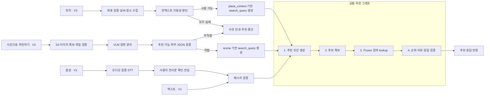

## 설계 결론

**V1은 텍스트 또는 사용자가 확인한 음성 전사문으로 음악을 추천하고, V2는 질문 없이 촬영한 사진만으로, V3는 위치 컨텍스트로 같은 추천 흐름에 합류한다.** 추천 조건 생성 → 후보 확보 → iTunes 검증 → 최종 응답 생성의 네 단계를 LangGraph로 구성하는 설계다.

입력별 전처리와 추천 가능 여부 판단을 분리하면 V2·V3에서도 후보 확보·곡 검증·응답 생성을 재사용할 수 있다. 단계 간 전달 형식은 [1주차 내부 표준 스키마](../week1/03-서비스-아키텍처-모듈화.md)를 따른다. 외부 API와 모델 로직은 독립 함수와 Provider Adapter에 두며, LangGraph 채택이 모든 후속 변경을 없애는 것은 아니다.

LangChain은 공통 모델 호출 기능의 이점이 확인되면 도입한다. 영속 checkpointer는 중간 실행 상태를 저장하는 기능으로, 중단된 요청을 재개해야 할 때 검토한다. 입력·모델 출력 검증과 예외 처리는 별도로 구현한다.

---

## 전체 파이프라인



V2에는 사용자가 작성한 질문이 필요하지 않다. FE가 사진을 업로드하고 추천을 요청하면 AI가 이미지를 검증한다. 검증 통과 후 채팅방에 사진을 확정 표시하고 추천을 진행하는 UI 흐름이며, 검증 요청 시점에는 채팅방 표시 전이라도 서버가 이미지에 접근할 수 있어야 한다. 정확한 요청 URL·응답은 [1주차 API 계약](../week1/01-모델-API-설계.md)을 따른다.

최종 곡 제목·아티스트·ID·링크는 iTunes 조회 결과로 조립한다. `preview_url`이 없으면 기존 계약대로 `null`을 반환하며, FE는 미리듣기 불가 상태를 표시한다.

---

## 입력 유형별 처리와 모듈 경계

| 버전·입력 | 전처리와 전달 계약 | 공통 추천에 진입하는 조건 |
|---|---|---|
| V1 텍스트 | 메시지 검증 → `message`, 선택적 `user_context` | 유효한 메시지 |
| V1 음성 | 파일 검증 → STT → 사용자 확인·전송 → V1 텍스트 계약 | 사용자가 전사문 전송을 확정 |
| V2 사진 | S3 이미지 확보·검증 → VLM → `recommendable`, `reject_reason`, `scene`, `search_query` | 사진이 추천에 적합하고 장면 출력 검증 통과 |
| V3 위치 | 좌표 검증 → 날씨·장소 수집 → `recommendable`, `reject_reason`, `place_context`, `degraded_sources`, `search_query` | 최소 하나의 컨텍스트 소스를 사용할 수 있음 |

`search_query`는 서버가 장면·위치 정보를 음악 검색용 문장으로 변환한 값이며, 사용자가 입력해야 하는 질문이 아니다. 원본 이미지·정확한 좌표를 추천 생성 모델에 다시 전달하지 않고 필요한 특징으로 변환한다. V2·V3의 추천 불가 판정은 공통 추천 호출 전에 처리한다.

---

## 모델·도구 선정

| 도구·모듈 | 선정 상태 | 역할과 이유 |
|---|---|---|
| FastAPI·Pydantic | 사용 | 입력·외부 출력·응답 계약 검증 |
| LangGraph | V1 채택 설계 | 네 추천 단계의 상태·실행 순서 관리 |
| LangChain | 조건부 | 모델 호출 추상화의 실익이 확인될 때 도입 |
| 관리형 LLM API | 1주차 기준선 유지 | OpenAI 기준선과 Gemini·Claude 비교는 [1주차 2번](../week1/02-모델-추론-성능-최적화.md) 참조 |
| 후보 확보 모듈 | 방식 미확정 | 모델 기반 후보 생성과 검색 기반 후보 확보를 같은 후보 형식으로 비교 |
| Music Provider | V1 설계 | 후보 ID가 있으면 lookup, 없으면 제목·아티스트 검색 후 실제 곡 매칭 |
| VLM Provider | V2 검토 | 관리형 멀티모달 API를 기준선으로 오픈웨이트 모델의 장면 추출 품질 비교 |
| STT / Weather / Places Provider | 버전별 설계 | 전사 및 위치 컨텍스트 수집을 추천 로직과 분리 |

오픈웨이트 VLM은 미채택 상태다. 실험 후보는 `qwen3-vl:4b`를 시작점으로, 같은 계열 8B를 품질 상향 비교군, `gemma3:4b`를 대안으로 둔다. 모두 Ollama에서 이미지 입력을 지원한다. 후보 선정은 일반 벤치마크 순위보다 실제 촬영 사진의 적합성 판정·필드 정확도·JSON 준수·지연·메모리 사용량으로 결정한다. [Qwen3-VL](https://ollama.com/library/qwen3-vl), [Gemma 3](https://ollama.com/library/gemma3)

로컬에서는 FastAPI와 Ollama 등 모델 서버를 별도 프로세스로 실행해 API 서버 재시작과 가중치 로딩을 분리한다. GPU 배포 플랫폼은 Modal로 정하며, AI 파트의 월 12만 원에서 LLM API와 GPU·CPU·메모리·저장 비용을 함께 관리한다. FE·BE·FastAPI의 AWS 운영비 월 약 30만 원은 클라우드 파트의 별도 예산이다. Modal은 초 단위 자원 과금과 사용이 없을 때 인스턴스를 0개로 줄이는 기능을 제공한다. 모델은 컨테이너 초기화 시 로딩해 재사용하며, 콜드 스타트와 준비된 상태의 지연·실제 청구 비용을 구분해 측정한다. [Ollama 모델 유지](https://docs.ollama.com/faq), [Modal 요금](https://modal.com/pricing), [Modal 콜드 스타트](https://modal.com/docs/guide/cold-start)

---

## 모듈 간 데이터

외부 요청 계약과 그래프 내부 작업 상태를 구분한다. 아래는 사진만으로 들어온 V2 전처리 결과의 예시다. 값은 설명용이며, 실제 허용값과 필드 제약은 1주차 계약을 따른다.

```json
{
  "recommendable": true,
  "reject_reason": null,
  "scene": {
    "environment": "outdoor",
    "place_type": "riverside_park",
    "time_of_day": "day",
    "weather": "sunny",
    "mood": ["peaceful", "refreshing"]
  },
  "search_query": "햇살 좋은 강변 산책에 어울리는 편안한 음악"
}
```

그래프 내부에서는 `conditions`(추천 조건), `track_candidates`(확인 전 후보), `verified_tracks`(iTunes 확인 곡)를 구분한다. 예를 들어 후보 5곡 중 3곡만 매칭되면 검증된 곡은 3곡이다. 상태 타입 선언만으로 데이터가 검증되지는 않으므로, 각 외부 출력은 별도로 검사한다.

---

## 구현 구조 — 설계 의사코드

아래는 아직 확정되지 않은 클래스·프레임워크 문법 대신 처리 책임과 순서를 보여주는 Python 형태의 의사코드다. 실제 구현은 이 네 단계를 LangGraph 노드로 연결한다.

```python
async def recommend(input_context):
    # API 계층에서 V1 메시지 또는 V2·V3 내부 계약을 검증한다.
    context = validate_input_context(input_context)
    if not is_recommendable(context):
        return handle_rejection(context)  # 1주차 오류·안내 계약

    conditions = await create_conditions(context)
    candidates = await retrieve_candidates(conditions)  # 방식 비교 중
    verified = await music_provider.resolve_tracks(candidates)

    if not verified:
        return {"message": "조건에 맞는 곡을 찾지 못했어요.", "tracks": []}

    ranking = await model_provider.rank_and_explain(context, verified)
    # 모델은 검증된 ID의 순위·이유만 제안한다.
    # 제목·URL은 verified에서 재조립하고, 미검증 ID는 거부한다.
    tracks = assemble_verified_tracks(verified, ranking)
    return validate_response({
        "message": build_result_message(tracks),
        "tracks": tracks,
    })
```

V1의 `message`와 V2·V3의 `search_query`·특징 객체를 `create_conditions`가 같은 추천 조건으로 정규화한다. 서로 다른 입력이 합류하는 것은 가능하며, 사진 요청에 가짜 사용자 메시지를 만들 필요는 없다. 별도 STT API는 전사문만 반환하고 추천을 실행하지 않는다.

---

## 실패 처리

| 실패 지점 | 처리 |
|---|---|
| 파일·요청 형식 오류 | 모델 호출 전 1주차의 입력 오류 계약으로 종료 |
| V2 사진 부적합 | `recommendable=false`와 사유를 기존 계약으로 변환하고 후보 조회 생략 |
| STT·VLM·추천 모델 호출 실패 | `503 SERVICE_UNAVAILABLE`, `details.reason`에 `TRANSCRIPTION_SERVICE_UNAVAILABLE` 또는 `MODEL_UNAVAILABLE` |
| iTunes 장애 / 정상 조회 결과 없음 | 장애는 `503 SERVICE_UNAVAILABLE / MUSIC_CATALOG_UNAVAILABLE`; 정상 조회 후 후보가 없으면 `200`, 빈 `tracks` |
| V3 일부 소스 실패 | 확보한 소스로 계속하고 `degraded_sources`에 내부 기록. 모두 실패하면 `503 SERVICE_UNAVAILABLE / LOCATION_CONTEXT_UNAVAILABLE` |
| 모델 출력 형식 오류 | 최대 1회 재생성 후에도 실패하면 모델 오류로 처리. 정상 빈 결과로 숨기지 않음 |

전송 재시도와 모델 출력 재생성은 구분하며, 요청 전체 시간·호출 예산 안에서 제한한다. 입력 오류와 정상적인 검색 결과 없음에는 같은 요청을 반복하지 않는다. 서버의 데이터 조립 버그는 모델 오류와 구분해 기록한다.

---

## 기대 효과와 병목

입력별 전처리를 분리하면 V2에서 VLM을 교체해도 후보 확보·iTunes 검증을 재사용할 수 있다. LangGraph는 단계 이름과 실행 경계를 제공하고, 단계별 지연·실패 기록은 별도로 구현한다. 네트워크 호출 수와 모델 대기가 증가하므로 다음 병목을 측정한다.

| 병목 | 확인 지표 | 우선 대응 |
|---|---|---|
| LLM·VLM 호출 | 단계별 p50·p95, 입력 크기, 출력 토큰 | 이미지 크기·출력 필드 제한, 모델 크기 비교 |
| GPU 콜드 스타트 | 최초 요청과 준비된 상태의 지연·과금 시간 | FastAPI와 모델 서버 수명 분리, 실험 요청 묶어서 수행 |
| 곡별 iTunes 조회 | 호출 수·매칭 성공률 | 후보 중복 제거, 요청당 호출 상한 |
| 위치 외부 API | 소스별 지연·실패율 | 날씨·장소 병렬 조회와 부분 결과 활용 |
| 후보 검색 품질 | 상위 5곡 적합도·제약 위반 | 음악 특성 중심 질의, 메타데이터 필터와 재정렬 비교 |

추천 후보 생성 방식과 RAG 데이터 소스는 아직 미확정이다. 검색 실험은 고정 평가셋에서 기존 후보 생성 방식과 비교하며, 코사인 유사도 자체를 품질 점수나 확률로 해석하지 않는다. 데이터 선정·임베딩·인덱스의 상세 결정은 단계 5에서 다룬다.

---

## 검증 계획

| 항목 | 측정 방법·기준 |
|---|---|
| V1 기본 품질 | 1주차 기준 유지: iTunes 검색 성공률 95% 이상, 재시도 전 JSON Schema 준수율 99% 이상 |
| 최종 정상 응답 | 응답 스키마 준수율 100%, 검증된 곡 ID·원본 메타데이터 일치 |
| V2 사진 입력 | 질문 없이 사진만으로 처리; 적합·부적합 사진의 판정과 장면 필드 정확도 평가 |
| V3 위치 입력 | 날씨만 실패·장소만 실패·모두 실패를 각각 검증 |
| 미리듣기·빈 결과 | URL 제공률, 샘플 실제 재생 성공, 빈 추천 비율을 별도 측정 |
| 지연·GPU 비용 | 전체·단계별 지연, GPU 로딩 포함 과금 시간, 요청당 비용 기록; 목표는 실측 후 확정 |

오픈웨이트 VLM·RAG의 채택과 임계값은 평가 후 확정한다. 구현 전 문서이므로 현재 수치는 실측 결과가 아니라 목표이며, 모델 호출 지연과 전체 파이프라인 지연을 구분한다.
