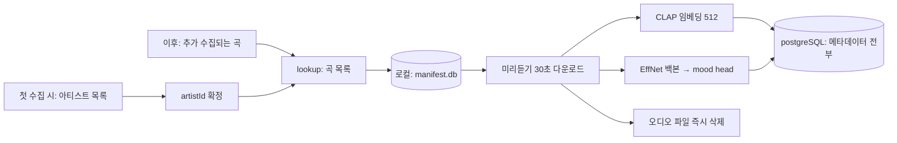
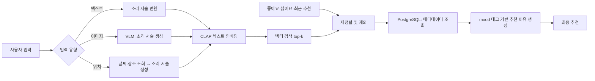

**수정 검토**

> 음악 추천은 정답이 하나가 아니다. 법령 문서 기반 챗봇처럼 검색된 근거와 답을 대조해 정확도를 판정할 수 없다. 따라서 "RAG를 붙이면 추천이 좋아지는가"를 사전에 단정할 수 없고, 어떤 형태의 컨텍스트 보강이 어느 단계에 필요한지를 구조적으로 판단해야 한다.
> 
> 이를 위해 파이프라인 전 구간을 250곡 규모로 먼저 구현하고 실측했다. 아래 설계는 그 결과에 근거한다.

---

## 설계 결론

머문음의 MVP에서 추천 생성에는 컨텍스트 보강을 적용하지 않는다. 추천 설명 생성에는 RAG를 적용한다.

근거는 다음과 같다.

**1. 검색 대상이 외부 지식이 아니라 우리가 구축한 곡 임베딩이다.**

일반적인 RAG는 외부 문서를 검색해 LLM 입력에 주입하고, LLM이 그것을 근거로 답을 생성한다. 본 서비스의 검색 대상은 문서가 아니라 미리듣기 오디오에서 직접 추출한 벡터이며, 검색 결과인 곡 목록이 곧 최종 산출물이다. 생성 단계가 존재하지 않으므로 주입할 지점이 없다.

**2. 생성 단계를 두면 할루시네이션이 발생한다.**

LLM이 곡을 직접 생성하는 방식을 사용하면 존재하지 않는 곡명이나 잘못된 아티스트가 반환될 수 있고, 이를 걸러내는 검증 계층이 별도로 필요해진다. 벡터 검색은 DB에 실재하는 track_id만 반환하므로 유효 곡 비율이 구조적으로 100%이며 검증 계층 자체가 불필요하다.

**3. 설명 생성에는 보강이 필요하다.**

추천 이유를 생성할 때는 검색된 곡의 mood 태그와 메타데이터를 LLM 입력에 추가한다. 이는 "검색 결과로 모델 입력을 증강"하는 RAG의 구조에 해당한다. 단 LLM은 검색된 후보 집합 밖의 곡을 언급할 수 없도록 제약한다.

**4. 자체 음악 지식은 이미 보유하고 있다.**

외부 음악 지식 DB를 구축하지 않는 이유는 데이터가 없어서가 아니라, 오디오 임베딩과 mood 태그가 그 역할을 대체하기 때문이다. 이에 더해 운영 중 상황별 플레이리스트나 검증된 추천 사례 같은 서비스 고유 데이터가 축적될 수 있을 것이다.

---

## 왜 벡터 검색인가

2024년까지 Spotify 웹 API에서 valence, energy 등 13개 규모의 태그를 사용하는 것이 확인되었다. 그러나 이후로 해당 태그들이 삭제되었고, 이와 비슷하게 음악의 성질을 담은 태그를 제공하는 API를 찾으려고 잠시 시도했으나, 이러한 태그를 이용한 추천 방식은 옳지 않다는 결론에 도달했다. 

다음은 태그 비교가 아닌 retrieval 자체를 벡터로 하는 근거이다.

**1. 추천은 순위 문제다**: 태그도 벡터이므로 거리 기반 순위 산출은 가능하지만, 저차원 태그나 수치 필드는 수천 곡을 사실상 같은 값으로 뭉개게 된다. 상위 20곡을 정렬해야 하는 작업에서 해상도가 부족하다. 512~1280차원 임베딩은 곡마다 고유한 좌표를 부여하고 사전 정의된 어휘에 없는 특성을 표현하며 정렬이 성립한다. 

**2. 자연어 입력을 처리할 유일한 방법이다**: 이미지·위치에서 생성된 문장과 곡을 비교하려면 둘을 같은 공간에 놓아야 한다. 자연어를 태그화시키는 방법이 있을 수 있지만, 이후에 나올 CLAP 방식을 통해 용이하게 자연어와 음악을 비교할 수 있다.

**3. 필드 방식은 원 제공자도 추천에 사용하지 않았다**: Spotify의 audio-features는 분석 및 콜드스타트 보완 용도였고 추천 엔진의 주 재료가 아니었다.

우리가 사용할 iTunes Search API는 audio-features류 또한 필드를 제공하지 않는다. 태그 방식은 택하지 말아야 하며, 택할 수도 없다.

---

## 핵심 검증 결과

### 자연어 → 음악 매칭이 성립한다

CLAP은 텍스트와 오디오를 공동으로 임베딩할 수 있는 모델이다.
해당 모델로 250곡을 임베딩하고 자연어 질의를 수행했다.

질의 | 상위 5곡
-- | --
aggressive distorted electric guitar | Metal 2, Hard Rock 1, Alternative 1, Rock 1
soft ambient synth pad | New Age 5
upbeat electronic dance beat | Dance 2, K-Pop 2, R&B 1

### 소리를 서술한 질의는 의도한 장르를 정확히 반환한다

따라서 장면 서술은 좋은 추천이 나오기 어려우며, 소리 서술로 변환해야 한다.

같은 의미를 두 방식으로 질의한 결과다. 단, CLAP은 영어 입력을 받아들이며, 다음 한국어 서술은 영어 서술을 한글로 임의로 바꾸어 보이는 것이다.

의미 | 장면 서술 최고 유사도 | 소리 서술 | 소리 서술 최고 유사도
-- | -- | -- | --
눈 내리는 밤 거리 | 0.183 | 차가운 여백의 쓸쓸한 피아노 | 0.554
러시아워 도심 | 0.223 | 정신없이 몰아치는 빽빽한 타악기 | 0.356
비 오는 저녁 창가 | 0.473 | 조용하고 아련한 느린 피아노 | 0.519
해변의 오후 | 0.331 | 따뜻하고 여유로운 여름 기타 |0.347
산 정상의 노을 | 0.369 | 벅차오르는 웅장한 현악기 | 0.386

장면 서술 시 0.183은 사실상 노이즈 수준이며, "햇살 좋은 해변"과 "눈 내리는 밤거리" 같은 상반된 장면이 거의 동일한 곡을 반환했다. 소리 서술로 변환하면 최대 3배 개선되고 각 항목 별 추천되는 상위 3곡이 거의 중복되지 않았다.

마찬가지로 VLM은 사진을 묘사해서는 안 되고, 사진에 어울릴 음악을 소리로 묘사해야 할 것이다. 이 변환 프롬프트가 추천 품질을 직접 좌우하며, v1에서 설계해 v2·v3가 재사용한다.

### 코퍼스 품질이 검색 결과를 좌우한다

16개 질의의 상위 5위 등장 횟수를 집계한 결과, 특정 곡들이 질의 내용과 무관하게 반복 등장했다.

곡 | 등장
-- | --
oh, the joy. - other side | 4회
Baby Beethoven - Ambient | 3회
Pet Music Maetro - Ambient | 3회

모두 스트리밍 플랫폼에 대량 유통되는 배경음악 계열이다. 음악적 개성이 낮아 임베딩 공간 중앙에 위치하며, 애매한 질의를 모두 흡수한다.

원인은 수집 방식이다. 장르를 통한 키워드 검색 `term=ambient`는 결과 품질을 통제할 수 없어 이런 곡이 다수 유입됐다. 임베딩 평균을 빼는 중심화 보정으로 결과 다양성이 63.7% → 70.0%로 개선되나, 근본 해결은 코퍼스 구성 자체를 바꾸는 것이다.

---

## 코퍼스 설계

### 실제 측정으로 확인한 API 제약

항목 | 확인 내용
-- | --
KR 스토어 | `media=music` 조회 시 결과 0건. US/JP/GB는 정상
페이지네이션 | `offset` 미지원. 값을 바꿔도 동일 결과 반환
쿼리당 상한 | 최대 200곡. 쿼리를 다양화하는 것 외에 확장 수단 없음
호출 제한 | IP 단위 분당 약 20콜. 초과 시 429
`artistTerm` | 퍼지 매칭으로 확인. LISA → David Sanborn, ROSÉ → James Horner 등 오매칭 발생

### 수집 전략

키워드 검색은 목록 품질을 통제할 수 없고 상한이 있으므로, 아티스트 기반 수집으로 전환했다. 다만, 수집 시 중복되지 않는 방향으로 모색한다.

1. 아티스트명을 `entity=musicArtist` 검색으로 `artistId`로 아티스트를 확정하여 퍼지 매칭을 제거  
2. `lookup?id={artistId}&entity=song`으로 해당 아티스트 곡만 정확히 조회  
3. `previewUrl` 없는 곡, 2010년 이전 발매곡 제외 (이 사항은 추후 토의하여 바꿀 수 있다)  
4. `trackId` 기본키로 협업곡 중복 자동 제거  

### 1차 범위

항목 | 값
-- | --
규모 | 아티스트 250명 × 최대 20곡 ≈ 5,000곡 (20곡 호출 실패 아티스트 존재 가능)
구성 | K-pop 40%, 팝·힙합·R&B 40%, 일렉트로닉·록 20%
제외 장르 | 클래식, 재즈, 앰비언트/수면음악, 어린이/홀리데이
발매 연도 | 2010년 이후
스토어 | US (KR 미제공)

클래식과 순수 재즈 류는 아티스트 추천에서 나오기 힘들지만, 이후 곡을 확장해서 포함한다면 동일 곡의 연주 버전이 다수 존재해 추천 목록이 중복되고, 장시간 곡에서 30초 미리듣기의 대표성이 낮다고 판단되어 제외했다. 파일럿에서 허브로 관측된 곡들이 이 계열에 집중된 점도 근거다.

곡의 규모도 중요하지만, 그보다 구성이 중요하다고 판단한다. 동일한 곡 수라도 특정 장르에 편중되면 다른 장르 질의가 벡터 공간의 희박한 영역에 떨어져 부적절한 결과를 반환한다.

### 1차 수집 결과

아티스트 250명 대상 `artistId` 기반 수집으로 4,937곡 확보(목표 5,000곡 대비 98.7%. 미리듣기는 임베딩 후 삭제했다). 곡 구성 비율은 설계 의도를 유지했고, 이 중 일렉트로닉·록 아티스트 기반 수집은 전부 성공했다. 수집 실패한 아티스트는 3명으로 원인은 US 스토어 카탈로그 부족 또는 2010년 필터다.

`artistTerm` 퍼지 매칭 방식에서는 250명 중 13명이 오매칭으로 확인됐으나, `artistId` 기반으로 전환한 뒤 실패가 3명으로 줄었다.

재수집 후 허브 현상이 해소됐다. 최다 등장 곡이 16개 질의 중 3회에 그쳤고, 등장 곡이 모두 실존 아티스트의 정규 발매곡이었다. 파일럿에서 상위를 점유하던 대량 유통 배경음악 계열은 전량 사라졌다.

임베딩 평균을 빼는 중심화 보정 또한 4937 곡 기준 결과 다양성이 82.5% → 92.5%로 개선된다. 연산 비용이 없고 부작용이 관측되지 않아 채택한다. 코퍼스 품질 개선 후 보정 효과가 오히려 커졌다.

의미 | 장면 서술 | 소리 서술 | 배수
-- | -- | -- | --
눈 내리는 밤 거리 | 0.293 | 0.496 | 1.7x
러시아워 도심 | 0.310 | 0.469 | 1.5x
비 오는 저녁 창가 | 0.281 | 0.515 | 1.8x
해변의 오후 | 0.236 | 0.601 | 2.5x
산 정상의 노을 | 0.426 | 0.476 | 1.1x
전주 거리 행보 (추가) | 0.410 | 0.546 | 1.3x

코퍼스를 제대로 변경했을 때도 소리 서술의 유사도가 좋게 나옴을 확인할 수 있으며, 각 항목 별 중복되는 곡 또한 없었다. 단 한 항목에 대해서는 같은 아티스트의 곡이 나오는 경우가 있었는데, 표본을 늘려 다양성을 측정해 이러한 현상이 빈번히 발생하는지 확인할 것이다.

### 소리 서술 영어 생성

CLAP의 텍스트 인코더는 roberta-base 기반 영어 전용 모델이며 학습 데이터인 오디오 캡션도 영어다. 한국어 입력은 유의미한 벡터를 생성하지 못한다.

실측 결과, 같은 의미의 영어-한국어 문장 쌍의 코사인 유사도가 -0.047 ~ 0.058로 무관한 수준이었다. 더 중요하게는 의미가 정반대인 한국어 문장 두 개("느린 피아노" vs "시끄러운 헤비메탈")의 유사도가 0.912로 나타났다. 한국어를 부정확하게 처리하는 것이 아니라 모든 한국어 입력을 사실상 동일한 좌표로 축약한다는 뜻이며, 한국어 질의는 내용과 무관하게 같은 결과를 반환한다.

따라서 사용자 입력은 한국어로 받되, LLM이 소리 서술을 생성하는 단계에서 영어로 출력한다. v2와 v3에서 자연어 변환이 이미 필요하므로 단계적으로 추가되지 않지만, v1에서 추가적으로 자연어를 영어 소리 서술 문장으로 표현하는 과정이 필요할 것이다. 내부 스키마 안의 `sound_description`은 영어, 사용자에게 노출되는 추천 이유는 한국어로 분리한다.

## 데이터 흐름

### 배치 (로컬, 1회성)



오디오 파일은 저장하지 않는다. 임베딩 추출 직후 삭제하며, 서비스는 Apple CDN의 `previewUrl`과 `artworkUrl`을 참조만 한다. 따라서 스토리지·전송 대역폭 요구가 사실상 없고 재배포에 해당하지 않는다.

곡 단위로 임베딩하고 바로 지우는 스트리밍 처리로 디스크 사용량을 20GB → 4.5GB로 낮췄고, sqlite manifest에 곡별 상태를 기록해 중단 시 재개가 가능하다.

### 서빙 (요청마다)



임베딩 계산은 배치에서 완결되므로 서버에 GPU와 ML 런타임이 필요하지 않다.

## 저장소 구성

데이터 | 저장 위치 | 규모 (20,000곡 기준)
-- | -- | --
사용자, 피드백 | MySQL | 수십 MB
곡 메타데이터 | PostgreSQL | 수십 MB
CLAP 벡터 512차원 | PostgreSQL | 41MB
mood 태그 상위 N개 | PostgreSQL (JSON) | 4.5MB
오디오·이미지 | 저장 안 함 | 0

PostgreSQL + pgvector를 통해 메타데이터와 벡터를 단일 테이블에 두어 필터 조건과 유사도 검색을 한 쿼리로 처리한다.

### 추천 벡터를 CLAP 단일로 두는 이유

EffNet 백본은 1280차원으로 곡→곡 유사도에서 강점이 있으나, 모든 진입점(텍스트·이미지·위치)이 자연어로 수렴하는 현재 서비스 흐름에는 곡→곡 경로가 존재하지 않는다. 따라서 벡터는 CLAP만 저장하고, EffNet은 최종 layer로 나오는 mood 태그 추출에만 사용한다.

**재검토 조건**: "비슷한 곡 더 보기" 기능이 요구사항에 추가될 경우. 배치 재실행으로 복구 가능하다.

## 입력 유형별 컨텍스트

### 텍스트와 음성

```json
{
  "message": "비 오는 퇴근길에 들을 음악을 추천해 줘.",
  "sound_description": "느리고 부드러운 피아노, 잔잔한 잔향, 차분하고 쓸쓸한",
  "conversation_context": ["앞선 대화에서 잔잔한 음악을 선호한다고 밝힘"],
  "preference_context": {
    "liked_track_ids": ["1234567890"],
    "disliked_track_ids": ["1234567891"],
    "recent_track_ids": ["1234567892"]
  }
}
```

`sound_description`이 실제 검색에 사용되는 필드다. 원문 `message`는 로깅과 디버깅용으로 보존한다.

음성 입력은 STT 결과를 바로 추천에 사용하지 않는다. 사용자가 전사문을 확인·수정하고 전송한 텍스트만 추천 입력으로 사용한다.

신규 사용자이거나 피드백 기록이 없다면 `preference_context` 없이 현재 메시지만으로 추천한다. 추후 콜드스타트 문제를 해결하기 위해 초반 선호 장르를 띄우는 방식을 채택할 수 있다.

### 사진

```json
{
  "input_type": "image",
  "recommendable": true,
  "scene": ["sunset", "river", "walking_path"],
  "mood": ["warm", "calm"],
  "time_of_day": "evening",
  "sound_description": "wide slow strings, uplifting cinematic build, spacious"
}
```

원본 이미지는 VLM 분석에만 사용하고, 이후 음악 추천에는 정규화한 풍경 특징을 사용한다.

### 위치

```json
{
  "input_type": "location",
  "weather": "clear",
  "time_of_day": "evening",
  "area_density": "medium",
  "place_categories": ["park", "river", "cafe"],
  "sound_description": "warm acoustic guitar, relaxed tempo, bright major key"
}
```

정확한 좌표는 날씨와 주변 장소를 조회하는 데만 사용한다. 추천 모델에는 정규화한 날씨·시간대·장소 특징을 전달한다.

---

## 추천 이유 생성

검색이 끝난 뒤, 선정된 곡의 태그를 LLM 입력에 추가해 설명을 생성한다.

```
입력 상황: 비 오는 저녁 창가
추천 곡 태그: melancholic 0.71, calm 0.64, dream 0.58
→ "차분하고 몽환적인 분위기가 비 오는 저녁과 어울려요"
```

LLM은 곡을 선정하지 않는다. 이미 확정된 결과를 설명할 뿐이므로 없는 곡을 언급할 여지가 없다. 프롬프트에 후보 집합을 명시하고 그 밖의 곡을 언급하지 않도록 제약한다.

mood 태그는 EffNet을 통해 배치에서 미리 추출해 저장한다. 서빙 시점에 생성하면 오디오를 다시 받아 모델을 실행해야 하므로, 서버에 ML 런타임이 불필요하다는 설계 전제가 무너진다.


---

## 사용자 데이터

본 서비스는 추천 결과에 대한 명시적 평가(좋아요·싫어요)나 선택 행동을 수집하지 않는다. 수집되는 데이터는 두 가지이며 성격이 다르다.

데이터 | 내용 | 용도
-- | -- | --
추천 기록 | 시스템이 반환한 곡 목록 | 반복 추천 방지, 로깅
격자 저장 | 사용자가 특정 위치에서 직접 등록한 곡 | 취향 추정, 장소-음악 연결

격자 저장은 추천 결과와 무관한 독립 행동이다. 사용자가 그 장소에서 인상 깊었던 곡을 직접 등록하는 것이므로, 추천 품질에 대한 피드백으로 해석할 수 없다.

현재 구조에서는 추천이 적절했는지를 사용자 행동으로 확인할 수 없다. 따라서 추천 품질 평가는 전적으로 고정 평가 세트 기반 내부 블라인드 평가에 의존한다.

향후 최소한의 신호를 얻으려면 미리듣기 재생 여부나 재생 지속 시간 같은 암묵적 지표를 검토할 수 있으나, 현재 요구사항에는 포함되어 있지 않다.

**격자 저장의 활용**

1. 취향 벡터. 사용자가 등록한 곡들의 CLAP 벡터 평균을 취향 좌표로 사용하고 질의 벡터와 가중 합산한다. 추천 목록에서 고른 것이 아니라 직접 선택한 곡이므로 시스템 편향이 섞이지 않은 신호다.

2. 장소-음악 데이터. 특정 격자에 등록된 곡들의 벡터 평균은 그 장소의 음악적 성격을 나타낸다. 이는 오디오 임베딩만으로는 얻을 수 없는 서비스 고유 데이터이며, v3 위치 기반 추천에서 위치를 소리 서술로 변환하는 경로보다 직접적인 신호가 된다.

사용자 데이터가 축적되면 이 데이터가 곧 검색 기반 컨텍스트 보강의 지식 소스가 된다. 도입 조건 절의 "서비스 고유 데이터"가 이에 해당한다.

## 협업 필터링 미채택

협업 필터링은 사용자-곡 상호작용 행렬을 분해해 사용자와 곡을 같은 공간의 벡터로 표현하는 방식으로, 소리가 달라도 함께 소비되는 곡을 연결하는 강점이 있다. 오디오만 보는 모델이 포착할 수 없는 정보다.

다만 신규 곡과 신규 사용자 모두 이력이 없어 벡터를 생성할 수 없는 콜드스타트 문제가 있으며, 본 서비스는 사용자 데이터가 축적되지 않은 상태이므로 적용할 수 없다.

본 프로젝트가 채택한 오디오 임베딩은 청취 이력 없이 벡터를 생성하므로 이 제약이 없다. 상용 서비스에서도 오디오 임베딩은 협업 필터링의 콜드스타트를 보완하는 용도로 병행 사용된다. 두 방식은 대체 관계가 아니라 보완 관계이며, 사용자 데이터가 축적되면 하이브리드 구성으로 확장 가능하다.

도입 시에는 행렬 분해 계열을 채택한다. 이웃 기반(user-user, item-item) 방식은 유사도 행렬만 산출하여 오디오 임베딩과 결합할 수 없는 반면, 행렬 분해는 곡을 벡터로 표현하므로 기존 CLAP 벡터와 동일한 저장·검색 구조를 공유한다. 나아가 오디오 임베딩에서 협업 필터링 벡터를 예측하는 회귀 모델을 두면 이력 없는 신규 곡에도 좌표를 부여할 수 있다. 현재 파이프라인은 이 확장의 전제 조건을 이미 충족한다.

---

## 추천 품질 평가

### 객관 지표

지표 | 확인 내용 | 비고
-- | -- | --
유효 곡 비율 | 반환된 곡이 카탈로그에 실재하는가 | 구조적으로 100% — 벡터 검색은 DB의 `track_id`만 반환
미리듣기 제공률 | `previewUrl`이 실제 재생되는가 | 수집 시 `previewUrl` 없는 곡을 제외하나, 설계 변경 시 확인 필요
요청 조건 준수율 | 명시적 조건·제외 요청을 지키는가 |  
중복 추천률 | 동일 곡·아티스트·버전 반복 | 아티스트 다양성 규칙 효과 측정
질의-결과 유사도 | 상위 결과의 코사인 유사도 | 0.2 미만은 매칭 실패 신호
결과 다양성 | 서로 다른 질의가 서로 다른 곡을 반환하는가 | 허브 현상 감시. 파일럿 82.5% → 중심화 후 92.5%
응답 시간 | p50 / p95 |  

유효 곡 비율과 미리듣기 제공률은 구조적으로 보장되므로 회귀 감시용으로만 둔다. 이 두 지표에 검증 계층을 두지 않는 것이 본 설계의 이점이다

### 주관 평가

각 추천곡을 다음 기준으로 평가한다.

| 점수 | 기준 |
|---|---|
| 0점 | 요청과 관련 없거나 명시적인 조건을 위반함 |
| 1점 | 어느 정도 어울리지만 추천 근거가 약함 |
| 2점 | 상황과 잘 어울리고 추천 이유도 납득 가능함 |

**평가 항목**: 상황 적합성, 명시 조건 준수, 목록 다양성, 추천 이유 타당성, 피드백 반영 여부.

팀원 2명이 생성 방식을 가린 상태로 독립 평가한다. 추천 이유를 읽기 전에 곡 적합성을 먼저 평가한다.

---

## 고정 평가 세트

30개 요청으로 구성한다. 20개는 개선용, 10개는 최종 확인용으로 분리한다.

- 감정: 우울함, 설렘, 긴장, 평온함
- 장면: 노을, 야경, 비 오는 거리, 산책
- 활동: 공부, 출근, 운동, 휴식
- 제약: 국내곡, 최신곡, 잔잔한 곡, 신나는 곡
- 후속 요청: 더 신나게, 같은 가수 제외
- 개인화: 피드백 이력이 있는 사용자

각 요청은 원문과 소리 서술 변환본을 함께 보관한다. 변환 프롬프트를 수정할 때 동일 요청으로 재현 비교하기 위함이다

평가 세트는 코퍼스나 검색 데이터에서 자동 생성하지 않는다. 저장된 데이터를 그대로 정답으로 삼으면 순환 평가가 된다

---

## 비교 실험

실험 | 구성 | 확인 목적
-- | -- | --
A | 원문 질의 그대로 CLAP 검색 | 기준선
B | 소리 서술 변환 후 검색 | 변환 단계의 효과 (파일럿에서 최대 3배 확인)
C | B + 중심화 보정 | 허브 억제 효과
D | C + 격자 저장 반영 | 개인화 효과
E | D + 연령대·성별 | 인구통계 정보의 효과 및 부작용

여러 요소를 동시에 적용하지 않고 분리하여 비교한다.

E에서 개선이 없거나 특정 집단에 획일적 결과를 만들면 해당 정보를 입력에서 제외한다.

---

## 도입 전후 검증

| 항목 | RAG 미적용 | RAG 적용 | 판단 기준 |
|---|---:|---:|---|
| 추천 적합성 | [측정 후 입력] | [측정 후 입력] | 블라인드 평가 결과 개선 |
| 추천 다양성 | [측정 후 입력] | [측정 후 입력] | 반복 추천 감소 |
| 요청 조건 준수율 | [측정 후 입력] | [측정 후 입력] | 명시적 조건 위반 감소 |
| 실제 곡 조회 성공률 | [측정 후 입력] | [측정 후 입력] | 유효 곡 비율 유지 |
| 미리듣기 제공률 | [측정 후 입력] | [측정 후 입력] | 재생 가능한 결과 유지 |
| p95 응답 시간 | [측정 후 입력] | [측정 후 입력] | 서비스 허용 지연 이내 |
| 요청당 비용 | [측정 후 입력] | [측정 후 입력] | 품질 개선 대비 비용 검토 |

항목 | 변환 미적용 | 변환 적용 | 판단 기준
-- | -- | -- | --
질의-결과 유사도 | [측정 후 입력] | [측정 후 입력] | 파일럿에서 확인
상위 결과 다양성 | [측정 후 입력] | [측정 후 입력] | 허브 감소
주관 적합성 | [측정 후 입력] | [측정 후 입력] | 블라인드 평가 개선
목록 다양성 | [측정 후 입력] | [측정 후 입력] | 반복 추천 감소
p95 응답 시간 | [측정 후 입력] | [측정 후 입력] | LLM 변환 호출 1회 추가분
요청당 비용 | [측정 후 입력] | [측정 후 입력] | 품질 개선 대비

동일한 평가 세트, 모델 설정, 코퍼스에서 비교한다.

---

## 추가 보강 도입 조건

다음이 모두 충족될 때 검색 기반 컨텍스트 보강(상황별 플레이리스트, 검증된 추천 사례 등)의 도입을 검토한다.

1. 출처와 사용 권한을 확인한 데이터가 확보된다
2. 현재 구조의 구체적 실패 패턴이 평가로 확인된다
3. 해당 데이터가 그 실패를 보완한다는 가설이 있다
4. 동일 조건 비교 실험에서 개선이 확인된다
5. 추가 지연과 비용이 허용 범위 안이다

현재는 보강 데이터 구축보다 코퍼스 품질 확보, 소리 서술 변환 프롬프트 설계, 고정 평가 세트 구성을 우선한다. 파일럿 결과상 추천 품질을 가장 크게 좌우하는 요인이 이 세 가지였기 때문이다.

---

## 미결 사항

- **소리 서술 생성 프롬프트**: 본 설계의 핵심 근거인 변환 효과는 수작업으로 만든 문장으로 측정했다. LLM이 동등한 품질의 소리 서술을 생성하는지는 검증되지 않았다. 최우선적으로 실험해야 할 항목이다
- **소리 서술 질의 속성 개수**: 속성 4개 이상 나열 시 개별 신호가 희석되는 현상이 관측됐다. 결과 병합 방식과 비교가 필요하다
- **태그 생성 방식**: EffNet + mood head 유지(A), CLAP 텍스트 인코더 활용(B), CLAP → 태그 증류(C) 중 선택. B·C 성립 시 배치에서 EffNet 의존을 제거할 수 있다
- **미리듣기 구간 대표성**: 도입부가 곡 전체와 다른 경우의 오매칭 되는 빈도를 측정해야 한다
- **매칭 실패 시 폴백**: 최고 유사도 0.3 미만일 때의 처리(재변환 / 조건 완화 / 재질의 요청)를 설계해야 한다
- **고정 평가 세트 30개 문안 미작성**: 비교 실험을 위해 평가용 QA를 만들어야 한다
- **응답 시간 및 요청당 비용 미측정**: 실제 답변이 나오는 시간을 측정하여 문제가 있다면 조절해야 한다