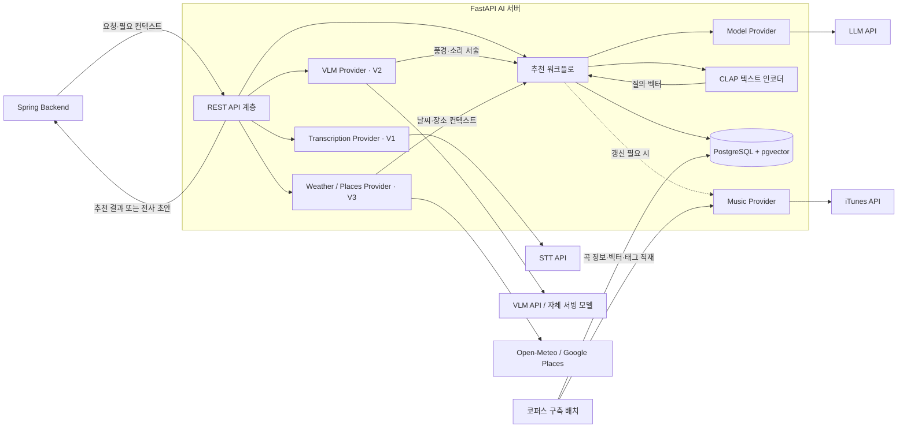

## 설계 결론

이 문서는 AI 서버가 사용하는 모델·외부 API의 선택, 호출 시점, 내부 인터페이스와 운영 정책을 정의한다. Spring과의 관계는 추천 요청·응답 및 데이터 소유 경계로 설명한다.

**MVP는 CLAP과 PostgreSQL + pgvector로 곡을 검색하고, 관리형 LLM으로 영어 소리 서술과 한국어 추천 이유를 생성한다.** iTunes는 코퍼스 수집과 카탈로그 정보 갱신에 사용하며, Spring Backend와 AI Server 사이는 기존 REST 계약을 유지한다. 생성 모델의 자체 서빙은 품질·지연·비용을 측정한 뒤 비교하고, MCP는 고정된 소수 도구를 한 AI Server가 호출하는 현재 범위에는 도입하지 않는다.

이 판단은 1주차 2번의 모델 비교와 단계 6 설계 과제 3번을 연결한다. `gpt-5.6-luna`를 MVP 기준선으로 사용하고, Gemini와 Claude는 동일 평가셋으로 품질·지연·비용을 비교하는 후보로 유지한다. 비교 후보는 검증된 장애 대체 수단이 아니므로 자동 fallback으로 연결하지 않는다.

[단계 5](./05-데이터%20컨텍스트%20보강%20설계.md)의 1차 수집 결과는 4,937곡이다. 이 문서는 해당 코퍼스와 CLAP 512차원 벡터를 사용하는 통합 설계를 기준으로 한다. 곡 선정·순위는 벡터 검색과 제외·재정렬 규칙이 담당하며, LLM은 선정된 곡의 메타데이터와 mood 태그를 근거로 설명을 작성한다. 검색 결과를 설명 입력에 보강하는 부분에 RAG를 적용하며, LLM이 곡명이나 곡 ID를 새로 생성하도록 맡기지 않는다.

---

## 외부 서비스 통합 구조



구조도는 호출 관계를 나타낸다. 음성은 전사 초안을 반환하고, 사용자가 확인·전송한 텍스트가 별도 추천 요청으로 들어온다. 사진·위치 Provider는 해당 입력 유형에서만 호출하며, iTunes 조회는 코퍼스 구축과 필요한 정보 갱신에 사용한다.

### Spring과의 연동 경계

Spring은 사용자 권한을 확인하고 요청과 필요한 컨텍스트를 AI에 전달한다. AI는 곡 검색·추천 이유 생성 결과를 반환하며, 회원·대화·추천 히스토리는 Spring의 MySQL에서 관리한다. AI는 검색용 PostgreSQL + pgvector를 직접 사용한다.

연동 시에는 `track_id`의 문자열 표현, 조회 스토어, `preview_url`의 nullable 규칙과 결과 부족·오류 응답을 계약 예제로 확인한다. Spring의 일반 음악 검색과 같은 곡을 연결할 수 있도록 식별 기준을 합의한다.

### 카탈로그 국가와 식별자

AI 코퍼스는 단계 5에서 수집한 US 스토어를 기준으로 하며, 저장된 곡의 갱신도 같은 스토어와 `track_id`로 수행한다. `country`는 가사 언어나 아티스트 국적이 아니라 조회 스토어를 의미한다. 따라서 현재 코퍼스를 한국 노래 전용으로 표현하지 않으며, 국내곡 조건은 별도 분류 기준이 필요하다.

단계 5의 KR 조회 0건은 해당 실험의 관측 결과로 기록하고, 모든 요청에서 KR이 지원되지 않는다고 일반화하지 않는다. AI의 곡 조회·캐시 키에는 스토어와 곡 ID를 함께 사용한다. Spring에 전달할 스토어 필드와 국가가 다를 때의 곡 연결 기준은 연동 검토에서 확정한다.

### AI 데이터 저장과 접근

| 데이터 | 소유·저장 위치 | 판단 근거 |
|---|---|---|
| 사용자·사용자 저장 곡·격자 등록 정보 | Spring MySQL | 사용자 권한과 서비스 트랜잭션의 기준 데이터 |
| 추천 결과 기록·연결된 `track_id` | Spring MySQL | 채팅방·사용자 권한과 연결하며 저장 범위·기간은 서비스 정책으로 결정 |
| 곡 메타데이터·mood 태그·CLAP 벡터 | AI 전용 PostgreSQL + pgvector | AI가 생성·갱신·평가하며, 메타데이터 조건과 벡터 검색을 함께 처리 |

FastAPI는 AI DB에 직접 접근하고, 사용자·격자 저장·최근 추천 정보는 Spring이 합의된 계약으로 전달한다. AI가 Spring MySQL을 직접 조회하거나 수정하지 않는다. 수집 배치는 곡 정보·태그·벡터를 갱신하고, 서빙은 검색 및 필요한 카탈로그 정보 갱신 권한만 갖는다. 코퍼스와 임베딩 모델·전처리·중심화 보정 버전을 함께 관리하며, 서로 다른 버전의 벡터를 섞어 검색하지 않는다.

### 배치와 온라인 호출의 분리

| 시점 | 처리 | 외부 호출·저장 원칙 |
|---|---|---|
| 코퍼스 구축 | 아티스트 식별 후 곡 수집, 오디오 임베딩·mood 태그 추출 | iTunes 메타데이터와 `previewUrl`을 함께 확보. 오디오 처리는 아래 이용 조건 확인 대상 |
| 추천 요청 | 영어 `sound_description` 생성 → CLAP 텍스트 임베딩 → 벡터 검색·재정렬 → 한국어 이유 생성 | 저장된 곡·태그를 사용. 추천마다 iTunes 검색을 반복하지 않음 |
| 카탈로그 갱신 | 오래된 정보·재생 실패 항목의 ID 기반 재조회 | URL·확인 시각·가용 상태 갱신. 타임아웃은 미제공으로 확정하지 않음 |

오디오 인코딩과 mood 추출은 배치에서 수행하지만, CLAP **텍스트 인코딩은 매 추천 요청에 필요하다.** 따라서 온라인 추론 런타임은 필요하며, CPU 처리 가능 여부와 GPU 필요성은 지연·처리량 측정으로 결정한다. 중심화 보정을 사용하면 질의에도 코퍼스 구축 시 정한 동일한 변환 규칙을 적용한다.

수집 시 미리듣기가 있었더라도 이후 재생을 보장하지 않는다. 초기 운영안은 `preview_url`, 스토어, 조회 확인 시각과 상태를 저장하고, 설정한 갱신 주기를 지난 항목만 재조회하는 방식이다. 주기는 실패율과 호출량을 측정해 확정한다. 응답에는 `track_view_url`도 포함하고, 재생 실패는 클라이언트에서 처리한다.

### 음원 이용 조건

메타데이터 캐싱과 미리듣기 음원 저장은 구분한다. Apple 공개 조건은 홍보 목적의 스트리밍을 허용하면서 미리듣기의 다운로드·저장·캐싱을 제한하며, 비상업적 부트캠프에 대한 별도 예외를 명시하지 않는다. 단계 5의 수집·삭제 기록은 실험 수행 사실이며 이용 허가를 입증하지 않는다. CLAP·mood 특징 추출과 파생 데이터 보관의 허용 범위를 별도로 확인하고, 확인 전에는 해당 실험을 운영용 수집 허가로 간주하지 않는다. [Apple 이용 조건](https://developer.apple.com/library/archive/documentation/AudioVideo/Conceptual/iTuneSearchAPI/index.html)

---

## 외부 서비스 목록

| 서비스 | 적용 범위 | 호출 목적 | 선택 상태·주요 제약 |
|---|---|---|---|
| OpenAI LLM Provider | V1~V3 | 영어 소리 서술·한국어 추천 이유 생성 | MVP 기준선 `gpt-5.6-luna`, 품질 미달 시 `gpt-5.6-terra` 비교 |
| Google Gemini Provider | 비교·V2 | 동일 추천 작업과 멀티모달 비교 | Flash-Lite·Flash 비교군. 운영 미채택 |
| Anthropic Claude Provider | 비교 | 동일 추천 작업의 정성·품질 비교 | Haiku·Sonnet 비교군. 운영 미채택, 자동 fallback 아님 |
| STT Provider | V1 | 음성을 텍스트 초안으로 변환 | 미확정. 오디오 형식·30초 제한 검증 |
| VLM Provider | V2 | 사진 적합성 판단과 풍경 분석 | 미확정. 이미지 크기, 품질, 추론 비용 비교 |
| iTunes Search API | 배치·V1~V3 | 곡 수집과 미리듣기·스토어 정보 갱신 | AI는 US 코퍼스 기준. 조회 성공과 실제 재생 성공을 분리 측정 |
| Open-Meteo | V3 | 현재 날씨 조회 | 무료 API의 비상업적 이용 조건·호출 제한·가용성 보장 부재 확인 |
| Google Places | V3 | 주변 장소 유형 조회 | API 종류·요청 필드별 과금, 저장 제한·출처 표시 확인 |
| Modal | V2 실험 | 오픈웨이트 VLM 서빙 | 플랫폼 선택, 모델 미채택. 자원 사용 시간·콜드 스타트 측정 |

모델 ID·단가·통과 기준은 [1주차 2번](../week1/02-모델-추론-성능-최적화.md)을 참조한다. 1주차가 **어떤 모델을 선택할지** 평가한다면, 이 문서는 **선택한 API를 어떻게 격리하고 운영할지** 정의한다. Last.fm·MusicBrainz는 조사 후보이며 현재 채택 목록에 포함하지 않는다. 서비스별 조건은 [Open-Meteo](https://open-meteo.com/en/pricing), [Places 과금](https://developers.google.com/maps/documentation/places/web-service/usage-and-billing), [Places 저장·표시 정책](https://developers.google.com/maps/documentation/places/web-service/policies)을 기준으로 확인한다.

---

## Provider Adapter 설계

외부 응답은 Adapter에서 내부 형식으로 변환하고 검증한다. 아래는 구현 클래스가 아닌 모듈 간 책임이다. 외부 REST 필드는 1주차 API 계약을 유지하고, 검색용 내부 컨텍스트는 단계 5의 영어 `sound_description`을 기준으로 한다. 기존 내부 스키마의 `search_query`와의 명칭 정합성은 구현 전에 맞춘다.

| Provider | 입력 | 내부 반환값·책임 |
|---|---|---|
| Model | 사용자·장소 컨텍스트 또는 선정된 곡·mood 태그 | 영어 `sound_description` 또는 한국어 추천 이유. 선정 곡의 ID를 변경하지 않음 |
| Music | 제목·아티스트 또는 카탈로그 ID·국가 | 곡 메타데이터·`preview_url`. 검색 결과 없음과 장애 구분 |
| Transcription | 검증된 오디오·MIME 타입 | 전사 초안만 반환. 사용자 확인·전송 후 별도 추천 요청 |
| VLM | 검증된 이미지 | 적합성·풍경 특징과 영어 `sound_description`. 부적합하면 검색 중단 |
| Weather | 검증된 좌표 | 날씨 특징 또는 소스 실패 상태 |
| Places | 검증된 좌표·검색 범위 | 장소 특징 또는 소스 실패 상태 |

V1은 확정된 `message`, V2는 질문 없이 사진에서 추출한 특징, V3는 위치 특징을 추천 컨텍스트로 정규화한다. 사진 요청에 가짜 사용자 메시지를 만들지 않는다. V2 부적합 판정은 추천 전에 종료하고, V3는 사용 가능한 소스가 하나라도 있으면 계속한다.

사진 전달은 현재 [1주차 API 계약](../week1/01-모델-API-설계.md)의 `image_base64`를 기준으로 한다. S3 객체 참조로 변경하는 안은 별도 연동 검토 사항이다. 변경 시에는 요청 필드뿐 아니라 이미지 확보 경로·접근 권한·삭제 시점을 함께 합의한다.

워크플로는 구체적인 OpenAI·Gemini·Claude·iTunes 클라이언트 대신 내부 인터페이스에 의존한다. 공급자를 바꿀 때 Adapter 구현과 환경 설정을 교체하며, 1주차의 REST 응답 계약은 유지한다. Weather와 Places는 일부 소스만 실패해도 위치 추천을 계속할 수 있도록 별도 Provider로 둔다.

---

## 외부 호출 정책

| 항목 | 정책 |
|---|---|
| Timeout | 전체 요청 시간 예산 안에서 Provider별 제한 시간을 두고, 필수 결과가 실패하면 후속 호출을 중단 |
| Retry | 재시도 가능한 타임아웃·`429`·일시적 `5xx`에 최대 1회. Adapter에서 관리하고 SDK 자동 재시도와 중첩 방지. `Retry-After`가 남은 시간보다 길면 종료 |
| Rate Limit | 동시성 상한과 시간당 요청·토큰 한도를 별도로 제어. 배치와 온라인 호출량을 합산하고, 계정·외부 IP 등 제한 단위를 다른 서비스와 공유하면 전체 사용량 확인 |
| Cache | 공급자 약관이 허용한 필드만 TTL을 정해 적용. 음악은 질의·국가·entity/ID, 날씨는 위치 구역·시간·요청 변수로 키 구성. Places는 일반 캐시로 취급하지 않음 |
| Fallback | 동일 계약과 평가 기준을 통과한 공급자만 사용. 없으면 1주차 오류 계약 또는 부분 결과 정책 적용 |

입력 오류, 지원하지 않는 파일과 검색 결과 없음에는 재시도하지 않는다. 전송 재시도와 모델 출력 형식 오류의 1회 재생성은 전체 시간·호출 예산 안에서 구분해 기록한다. 요청에 `request_id`가 없으면 AI 진입 시 내부 추적 ID를 생성하며, 외부 계약에 필수 필드를 임의로 추가하지 않는다. 음악 메타데이터는 AI DB의 저장 정보와 확인 시각을 활용하고, 미리듣기 음원은 캐시하지 않는다. Places는 place ID 등 허용 예외를 확인하며 응답 전체를 저장하지 않는다.

---

## 오류 변환

외부 서비스마다 다른 오류를 내부 공통 오류로 변환한다.

```json
{
  "code": "SERVICE_UNAVAILABLE",
  "message": "일시적으로 AI 기능을 사용할 수 없습니다.",
  "details": {
    "reason": "MUSIC_CATALOG_UNAVAILABLE"
  }
}
```

| 외부 오류 | HTTP | `code` | `details.reason` |
|---|---:|---|---|
| LLM·VLM 호출 실패 | 503 | `SERVICE_UNAVAILABLE` | `MODEL_UNAVAILABLE` |
| STT 호출 실패 | 503 | `SERVICE_UNAVAILABLE` | `TRANSCRIPTION_SERVICE_UNAVAILABLE` |
| iTunes 필수 조회 실패로 응답 구성 불가 | 503 | `SERVICE_UNAVAILABLE` | `MUSIC_CATALOG_UNAVAILABLE` |
| 날씨·장소가 모두 실패 | 503 | `SERVICE_UNAVAILABLE` | `LOCATION_CONTEXT_UNAVAILABLE` |

V3의 한 소스만 실패하면 확보한 컨텍스트로 진행하고 `degraded_sources`에 내부 기록한다. DB 검색 결과가 없으면 `200`과 빈 `tracks`, 미리듣기가 없으면 현재 계약에 따라 `preview_url=null`로 처리한다. 메타데이터 갱신만 실패하고 저장된 정보로 응답할 수 있으면 추천 전체를 실패시키지 않는다. 미리듣기 필수 3곡 정책을 적용할 경우 후보 보충과 부족 시 반환 규칙을 Spring과 합의한다. 사용자 응답에는 내부 스택, API 키, 공급자 원문 오류와 프롬프트를 포함하지 않는다.

---

## 인증과 데이터 보호

- 외부 API 키는 환경변수 또는 배포 환경의 Secret으로 관리한다.
- `.env`, 문서, 로그와 Git 저장소에 실제 키를 기록하지 않는다.
- 원본 음성·이미지·정확한 좌표는 기능 처리에 필요한 범위에서만 사용한다.
- 유료 API 여부와 별개로 학습 사용·보존 기간·삭제 설정을 확인한다. 학습 미사용이 무보존을 뜻하지 않는다. [OpenAI 데이터 관리](https://developers.openai.com/api/docs/guides/your-data)
- 로그에는 원본 입력 대신 `request_id`, 처리 시간과 오류 유형을 기록한다.
- 사용자 권한 검사는 Spring이 담당한다. AI 호출 주체 제한과 최소 권한을 적용하되, 내부 인증 방식은 클라우드 파트와 배포 전 확정한다.

---

## 관리형 API와 자체 모델 비교

| 기준 | 관리형 모델 API | 자체 모델 서빙 | MVP 판단 |
|---|---|---|---|
| 초기 비용 | 사용량 기반 과금, GPU 구축 불필요 | GPU 확보·배포 환경 구축 필요 | 관리형 API |
| 운영 비용 | 토큰·음성 길이 등 사용량에 따른 과금 | Modal 자원 사용 시간·저장 비용과 운영 공수 | 실제 트래픽으로 월 총비용 비교 |
| 성능·지연 | 외부 네트워크와 공급자 상태 영향 | 모델 크기·GPU·대기열·cold/warm 상태 영향 | 전체 추천 지연과 Provider 호출 지연을 분리 측정 |
| 호출 제한·확장 | 계정별 요청·토큰 한도에 의존 | GPU 처리량·컨테이너 상한에 의존 | 요청당 호출 수와 예상 동시 요청을 배포 전 확인 |
| 데이터 보호 | 공급자별 학습 사용·보존 정책 확인 | 팀과 서빙 플랫폼의 접근·삭제 책임 확인 | 입력 최소화·보존 설정 검증 |
| 모델 제어 | 공급자의 모델·버전·기능에 종속 | 가중치·양자화·배포 버전 제어 가능 | 실험과 운영 교체를 구분 |

p95는 요청의 95%가 해당 시간 안에 완료됨을 뜻한다. 1주차의 추천 p95 5초는 LLM 단독 호출이 아닌 전체 추천 목표이며, V2의 이미지 분석·콜드 스타트까지 같은 수치를 달성했다고 가정하지 않는다.

GPU 서빙 플랫폼은 Modal을 사용한다. AI 파트 월 12만 원 안에서 관리형 모델 API와 Modal GPU·CPU·메모리·저장 비용을 합산하며, FE·BE·FastAPI의 AWS 운영비 월 약 30만 원은 클라우드 파트의 별도 예산이다. 로컬에서는 FastAPI와 모델 서버를 분리해 API 재시작마다 가중치를 다시 로딩하지 않는다.

| 비용 항목 | 기록 값 |
|---|---|
| LLM·VLM | 모델명, 입력·출력 토큰, 호출 횟수 |
| STT | 오디오 길이, 요청 횟수 |
| Google Places | API 종류·과금 SKU·요청 필드, 반경 확장 포함 호출 횟수 |
| Modal | GPU 종류, 로딩·유휴 유지 포함 과금 시간, CPU·메모리·저장 비용 |
| 음악 카탈로그 | 배치·온라인별 요청 횟수, 저장 정보 재사용률, 갱신 실패율 |
| CLAP·DB 검색 | 텍스트 인코딩 시간, 검색 시간, CPU·메모리 사용량 |
| 전체 요청 | 기능별 평균·p95 비용 |

비용은 성공 응답뿐 아니라 실패·재시도 호출까지 합산한다. Modal은 0개로 축소할 수 있지만, 모델 로딩과 유휴 컨테이너의 자원 사용도 비용에 영향을 주므로 순수 추론 초만 계산하지 않는다. [Modal 요금](https://modal.com/pricing), [콜드 스타트·유휴 유지 비용](https://modal.com/docs/guide/cold-start)

서빙 경험을 위한 실험은 예산 안에서 진행하고, 운영 모델 교체는 동일 평가셋의 품질·지연과 월 총비용·운영 공수를 비교한 뒤 결정한다. API보다 저렴하다는 것을 실험의 전제로 두지 않는다.

---

## MCP 도입 판단

### 현재 도입하지 않는 이유

REST는 서비스 간 통신 방식이고 Provider Adapter는 코드 내부에서 공급자 차이를 흡수하는 설계다. MCP는 클라이언트·서버 사이에 도구와 리소스를 표준화해 노출하는 프로토콜이며, 두 개념과 같은 역할이 아니다. [MCP 구조](https://modelcontextprotocol.io/docs/2026-07-28/learn/architecture)

현재 한 AI Server의 고정 호출 흐름은 Adapter로 요청 검증·오류 변환·공급자 교체를 처리할 수 있다. 도구를 재사용할 별도 MCP 클라이언트가 아직 없으므로 추가 서버·권한 관리의 실익이 작아 도입하지 않는다.

### 재검토 조건

MCP는 여러 실행 환경이나 팀이 같은 도구를 검색·호출해야 하거나, 모델이 권한 범위 안에서 다양한 도구를 선택하는 요구가 생길 때 검토한다.

도입할 경우 도구별 권한, 요청 스키마, 허용 사용자, 호출 비용과 감사 로그를 먼저 설계한다.

---

## 기대 효과와 트레이드오프

REST와 Adapter 구조는 V1의 외부 호출 경계와 책임을 적은 구성 요소로 고정한다. 모델 변경은 Model Provider, iTunes 변경은 Music Provider에 제한되고 Spring·AI의 응답 계약은 유지된다.

새 도구는 내부 Provider 계약과 공통 오류·호출 정책을 통과한 뒤 추가한다. 여러 서비스에서 같은 도구 구현을 반복하게 되면 MCP 또는 전용 게이트웨이의 운영 비용과 중복 감소 효과를 다시 비교한다.

## 1차 검토 요청 사항

| 항목 | 현재 기준과 검토할 사항 |
|---|---|
| 데이터 이용 | 미리듣기 분석·파생 데이터 보관의 허용 범위 확인 또는 분석 가능한 음원 출처 확보 |
| 검색 품질 | 단계 5의 수작업 소리 서술 실험을 LLM 생성 문장으로 재검증. 유사도 상승과 사용자 적합도 개선을 구분 |
| 온라인 추론 | CLAP 텍스트 인코더의 CPU 지연·처리량 측정 후 배포 자원 결정 |
| 카탈로그 계약 | 스토어·곡 식별자 전달, URL 갱신 주기, 미리듣기 필수 여부·결과 부족 정책 합의 |
| 버전 간 정합성 | 내부 검색 필드를 `sound_description`으로 정리하고 V2 이미지 전달 방식 변경 여부 확인 |

5단계의 코퍼스 실험 결과와 이 문서의 운영 설계를 구분한다. 전체 요청 지연·비용, 자동 소리 서술의 추천 적합도와 장애 처리는 아직 검증 완료로 표시하지 않으며, 동일 코퍼스·평가 세트로 통합 후 확인한다.
