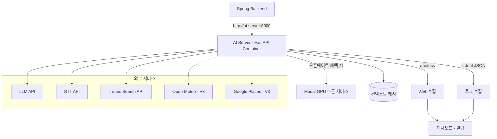

## 설계 결론

AI 서버는 FastAPI 애플리케이션을 Docker 이미지로 패키징하고, 외부 LLM·STT·VLM API를 호출하는 Stateless 서버로 운영한다. V1에서는 App EC2 한 대에서 Spring Backend와 함께 컨테이너 하나로 실행한다.

초기 트래픽이 검증되지 않은 상태에서 로드밸런서, 오토스케일링과 Kubernetes를 먼저 구성하지 않는다. AI 파트의 설계 부하는 평균 0.028 RPS, 피크 6 RPS이며 이 수준에서 다중 인스턴스는 안정성보다 운영 대상과 고정비를 먼저 늘린다.

대신 언제 확장할지 판단할 지표와 임계값을 지금 확정하고, 확장이 필요해졌을 때 코드 변경 없이 인스턴스를 늘릴 수 있는 구조를 유지한다.

AI 서버의 한계는 CPU가 아니라 외부 API 대기 시간과 호출 비용에서 먼저 발생한다. 따라서 확장 판단 기준을 CPU 사용률로 두지 않는다.

---

## 운영 요구사항

항목 | 기준
-- | --
사용자 환경 | 모바일 중심의 실시간 추천
호출 경로 | 모바일 → Spring Backend → AI Server. 클라이언트의 직접 호출 없음
상태 | AI Server는 무상태. 기록과 대화 저장은 Spring·RDS 담당
응답 시간 | 엔드포인트별 p50·p95 측정 후 목표 확정
가용성 | 외부 API 장애와 AI 서버 프로세스 장애를 구분
확장 단위 | 무상태 FastAPI 컨테이너
비용 관리 | 요청 유형별 모델·외부 API 비용 측정. AI 파트 예산 월 12만 원

설계 부하는 클라우드 파트의 트래픽 산정(MAU 6,000명 기준) 중 AI·외부 API 요청분이다. 평균 0.028 RPS, 알림 발송 후 1분 구간 피크 6 RPS이며, 피크 6 RPS를 부하 테스트의 목표 부하로 사용한다.

텍스트, 음성, 사진과 위치 추천은 호출하는 외부 서비스 수가 다르므로 하나의 응답 시간 목표를 일괄 적용하지 않는다. 특히 음성 전사는 성격이 다르다.

엔드포인트 | 주 자원 | 외부 호출
-- | -- | --
POST /v1/chat/messages | 네트워크 대기 | LLM + iTunes
POST /v1/transcriptions | CPU (FFmpeg 디코딩) | STT
POST /v1/chat/images (V2) | CPU + 네트워크 대기 | VLM + iTunes
POST /v1/location/recommendations (V3) | 네트워크 대기 | 날씨·장소 병렬 + LLM + iTunes

추천 요청은 대부분의 시간을 외부 응답 대기로 보내므로 CPU를 거의 쓰지 않는다. 반면 음성 전사는 FFmpeg 처리로 CPU를 실제로 점유한다. 2 vCPU를 Spring Backend와 공유하는 환경에서는 전사 요청이 몰릴 때 CPU를 쓰지 않던 추천 요청까지 함께 느려질 수 있다.

추천 대상 음원 메타데이터를 사전에 내부 DB에 구축할 경우, iTunes API에 대한 외부 호출 의존성을 완전히 제거하여 응답 지연(Latency)을 대폭 단축할 수 있다.

---

## 배포 아키텍처



AI Server는 호스트에 포트를 공개하지 않는다. `expose: 8000`만 선언하고 Docker Network 내부의 Spring Backend에서만 접근한다. 외부 인터넷에서 AI Server로 직접 도달하는 경로는 없다.

초기에는 컨테이너 한 개로 시작한다. 부하 증가 시에는 같은 이미지를 여러 인스턴스로 늘리고 앞단에 로드밸런서를 두는 구조로 확장하며, 이때 애플리케이션 코드 변경은 필요하지 않다.

---

## 배포 단위

```text
Docker Image (ECR · Commit SHA 태그)
├── FastAPI Application
├── Recommendation Workflow (LangGraph)
├── Provider Adapters (LLM · STT · VLM · iTunes · Weather · Places)
├── Input Validators
├── Response Models
└── Observability Configuration
```

항목 | 설정 | 근거
-- | -- | --
프로세스 | uvicorn, 워커 1개 | 외부 API 대기 중심이라 비동기 단일 워커로 충분. 측정 후 조정
노출 | expose: 8000 | Docker Network 내부 접근만 허용
메모리 제한 | 초기 제안 1GiB | 배포 중 Backend 두 개와 공존하므로 상한 필요
CPU 제한 | 초기 제안 1.0 | FFmpeg 처리가 Spring 자원을 잠식하지 않도록 제한
동시 요청 상한 | 50 | 무한 대기 누적 대신 빠른 실패
FFmpeg 동시 실행 | 2 | 전사 처리의 CPU 점유 제한
요청당 iTunes 호출 상한 | 10 | 후보 중복 조회 방지
요청당 모델 호출 상한 | 2 | 형식 오류 재생성 1회 포함
볼륨 | 없음 | 무상태 유지. 재생성해도 손실 데이터 없음

자원 제한값은 제안이며, 출시 전 실제 운영 이미지로 측정한 뒤 클라우드 파트와 함께 확정한다.

모델 가중치를 이미지에 포함하지 않으므로 CPU 인스턴스로 실행한다. 오픈웨이트 모델을 채택할 경우 GPU 추론 서버만 FastAPI와 분리하여 Modal에 배포하고, FastAPI 애플리케이션과 인스턴스 유형은 그대로 둔다.

### 외부 호출 타임아웃 예산

각 값은 설계 초기값이며 실측 후 조정한다. 상위 예산이 하위 예산의 합보다 크도록 유지한다.

구간 | 연결 | 응답 | 재시도
-- | -- | -- | --
AI → LLM API | 3s | 15s | 1회
AI → STT API | 3s | 20s | 1회
AI → VLM API (V2) | 3s | 20s | 1회
AI → iTunes | 2s | 5s | 1회
AI → Open-Meteo (V3) | 2s | 3s | 1회
AI → Google Places (V3) | 2s | 3s | 1회

Spring → AI Server 구간의 타임아웃은 풀스택 파트와 합의한다. 전송 재시도와 모델 출력 형식 오류에 따른 재생성은 구분하며, 입력 오류와 정상적인 "검색 결과 없음"에는 재시도하지 않는다.

---

## 확장 전략

단계 | 조건 | 대응
-- | -- | --
초기 운영 | 낮은 요청량 | 단일 AI 컨테이너
자원 간섭 | Spring과 AI가 서로의 지연에 영향 | AI Server를 별도 인스턴스로 분리
응답 지연 증가 | 동시 처리 요청 포화, p95 목표 초과 | 컨테이너 수평 확장과 로드밸런서
외부 API 제한 도달 | 429 응답 증가 | 동시 요청 상한 조정, 재시도 간격 확대
반복 조회 증가 | 동일 격자·검색 요청 증가 | 공유 캐시 적용
인스턴스 2대 이상 | 프로세스 메모리 캐시의 적중률 분할 | 캐시를 공유 저장소로 이전
오픈웨이트 적용 | GPU 추론 필요 | Modal에 별도 GPU 서비스로 분리

### 확장 판단 기준

AI 서버의 요청 처리 시간은 대부분 외부 API 응답 대기다. 동시 요청이 늘어 응답 시간이 목표를 넘는 상황에서도 CPU 사용률은 낮게 유지될 수 있다. CPU 기준 오토스케일링은 이 상태를 감지하지 못하므로 사용하지 않는다.

지표 | 임계값 (초기 제안)
-- | --
인스턴스당 동시 처리 중 요청 수 | 20 이상 5분 지속
POST /v1/chat/messages p95 | 목표값 초과 5분 지속
동시성 상한 도달로 인한 거부 | 5분간 1회 이상

p95 목표값은 실측 전에 확정하지 않는다. AI 파트가 위 상황을 판단 근거로 제시할 때의 오토스케일링 그룹의 구체적 파라미터는 클라우드 파트가 정한다.

Kubernetes는 관리 대상 서비스가 늘고 Compose 운영이 한계에 도달할 때 검토한다. 현재 팀 규모에서는 관리 비용이 이점보다 크다.

### 인스턴스보다 먼저 도달하는 한계

한계 | 확인 지표 | 우선 대응
-- | -- | --
LLM API 비용 | 요청당 토큰 수, 일일 누적 비용 | 프롬프트·출력 필드 축소, 후보 수 제한
LLM 호출 제한 | 429 응답 비율 | 동시 요청 상한, 재시도 간격
iTunes 호출량 | 요청당 조회 횟수 | 후보 중복 제거
Places 과금 (V3) | 호출 수, 캐시 적중률 | 반경 확장 비활성화, 캐시 TTL 확대

---

## 상태 확인

엔드포인트 | 목적 | 외부 API 호출
-- | -- | --
GET /health | FastAPI 프로세스와 필수 초기화 상태 확인 | 없음

헬스체크마다 LLM, STT, VLM 또는 iTunes를 호출하지 않는다. 외부 서비스 장애 때문에 정상 동작 중인 AI 서버 컨테이너가 반복 재시작되거나 로드밸런서에서 제외되는 상황을 방지하기 위해서다.

같은 엔드포인트를 Docker 헬스체크(10초 간격), Spring의 의존성 확인, 향후 로드밸런서 헬스체크에서 함께 사용한다. 호출 빈도가 높으므로 응답을 단순하게 유지하고 접근 로그에서는 제외하거나 샘플링한다.

외부 의존성 점검이 필요해지면 `/health`에 추가하지 않고 별도 readiness 엔드포인트 추가를 검토한다.

---

## 모니터링 지표

### API 지표

지표 | 구분
-- | --
요청 수 | 엔드포인트 · 상태 코드
응답 시간 | 엔드포인트별 p50 · p95 · p99
오류율 | 입력 오류 · 내부 오류 · 외부 서비스 오류
오류 원인 분포 | `MODEL_UNAVAILABLE`, `MUSIC_CATALOG_UNAVAILABLE`, `TRANSCRIPTION_SERVICE_UNAVAILABLE`, `LOCATION_CONTEXT_UNAVAILABLE`
처리 중 요청 수 | 인스턴스별 동시 처리량
동시성 거부 수 | 상한 도달로 거부한 요청
빈 추천 비율 | tracks=[] 반환 비율

빈 추천은 오류가 아니라 정상 응답이지만 비율이 오르면 추천 품질 문제이므로 오류율과 분리해 본다.

### 모델과 외부 서비스 지표

지표 | 구분
-- | --
외부 호출 지연 | 제공자별 p50 · p95
호출 성공률 | 제공자별 · 오류 유형별 (타임아웃 / 4xx / 5xx / 429)
재시도 발생률 | 제공자별
캐시 적중률 | 위치 컨텍스트 · 음악 조회
요청당 토큰 수 | 입력 · 출력
요청당 추정 비용 | 모델별 · 엔드포인트별
일일 누적 비용 | 월 예산 대비 비율

비용은 제공자 콘솔 청구액과 자체 계산값을 함께 본다. 자체 계산은 토큰 수에 단가를 곱한 추정치이므로 실제 청구액과 차이가 날 수 있고, 그 차이 자체가 중복 호출이나 누락의 단서가 된다.

### 시스템 지표

- 컨테이너 CPU · 메모리 사용량과 제한 대비 비율
- 컨테이너 재시작 횟수와 OOM 종료 여부
- 배포 버전(이미지 태그)별 오류율
- 네트워크 연결 오류 수
- GPU 사용률 · 메모리 · 콜드 스타트 시간

EC2와 RDS의 인프라 지표는 클라우드 파트가 수집한다. GPU 지표는 오픈웨이트 모델을 자체 서빙할 때만 적용하며, Modal은 사용량 과금이므로 콜드 스타트 지연과 준비된 상태의 지연, 실제 과금 시간을 구분해 기록한다.

### 수집과 시각화

AI 서버는 애플리케이션에서 Prometheus 형식의 `/metrics`를 노출하고, 로그는 표준 출력으로 내보낸다. `/metrics`는 호스트에 공개하지 않고 내부 네트워크에서만 접근한다.

수집 도구와 대시보드 스택은 Spring Backend와 공유하는 구성 요소이므로 클라우드 파트와 함께 선정한다. App EC2는 2 vCPU / 8GiB를 Nginx, Spring(배포 중 2개 존재), AI Server가 공유하므로, 수집·저장·시각화를 같은 인스턴스에 모두 올리면 관측 도구가 관측 대상을 불안정하게 만들 수 있다. 인스턴스에는 수집 에이전트만 두고 저장과 대시보드는 분리하는 것이 좋다.

AI 파트가 대시보드에서 필요로 하는 화면은 다음 네 가지다.

대시보드 | 주요 패널
-- | --
서비스 개요 | 엔드포인트별 요청 수·응답 시간·오류율, 처리 중 요청 수, 빈 추천 비율, 현재 배포 버전
파이프라인 단계 | 단계별 지연 분해, 전체 대비 모델 대기 비율, iTunes 매칭 성공률, 재생성 발생률
외부 의존성과 비용 | 제공자별 지연·성공률, 캐시 적중률, 일일 누적 비용, 요청당 토큰 수
컨테이너 | CPU·메모리 사용량과 제한 대비 비율, 재시작·OOM 이벤트, 배포 전후 자원 변화

알림은 응답 시간 저하, 5xx 급증, 외부 모델·음악 조회 장애, 컨테이너 반복 재시작, 동시성 거부 발생, 일일 비용 초과를 대상으로 한다. 구체적인 임계값은 실측 후 확정하며, 초기에는 넓게 잡고 오탐을 줄여가며 조정한다. 오탐이 잦은 알림은 무시하게 되므로 알림 수보다 신뢰도를 우선한다.

---

## 로그와 요청 추적

모든 서비스 구간에서 동일한 `request_id`를 사용한다. `request_id`는 API 계약상 Spring Backend가 발급해 전달하며, AI Server는 이를 로그에 그대로 전파한다.

```json
{
  "request_id": "7af45f58-b076-4c4c-91c8-aca7c7088232",
  "endpoint": "/v1/chat/messages",
  "status_code": 200,
  "total_latency_ms": 1820,
  "stage_latency_ms": {
    "conditions": 620,
    "candidates": 330,
    "catalog": 420,
    "response": 450
  },
  "model": "gpt-4.1-mini",
  "input_tokens": 480,
  "output_tokens": 210,
  "catalog_calls": 5,
  "candidate_count": 5,
  "track_count": 3,
  "image_tag": "a1b2c3d"
}
```

오류 시에는 `error_code`, `details.reason`, `provider`, `retry_count`를 추가로 남긴다.

사용자 메시지 원문과 전사문, 원본 음성·이미지, 정확한 좌표, API 키는 기본 로그에 기록하지 않는다. 좌표는 격자 단위로 낮춘 값만 남긴다. 오류 분석에 필요한 처리 단계, 지연 시간, 오류 코드와 크기·개수 정보만 기록한다.

추천 품질 분석을 위해 입력 원문이 필요해지면 별도의 동의·보관 정책을 정한 뒤 분리된 경로로 수집한다.

---

## 부하 테스트 계획

부하 생성 도구는 Python 기반의 Locust를 사용한다. AI 파트가 Python 기반으로 작업하므로 시나리오 작성과 외부 API 스텁 구현에 추가 학습이 필요하지 않고, 목표 부하가 6 RPS 수준이라 부하 생성기 자체의 성능은 제약이 되지 않는다.

### 두 가지 실행 모드

부하 테스트를 실제 LLM·STT API로 반복하면 두 가지 문제가 생긴다. 첫째, AI 파트 예산이 월 12만 원이므로 반복 테스트가 운영 전에 예산을 소진할 수 있다. 둘째, 외부 API 지연이 결과를 지배해 서버 자체의 처리 한계를 확인할 수 없다.

모드 | 구성 | 측정 대상
-- | -- | --
Mock | Provider Adapter를 고정 지연 스텁으로 교체 | 서버 처리량 한계, 동시성, 메모리
실호출 | 실제 API 호출, 소량·단시간 | 실제 지연 분포와 요청당 비용

Provider Adapter가 인터페이스로 분리되어 있으므로 환경변수로 구현체만 교체한다. Mock 스텁의 고정 지연값은 실호출 모드에서 측정한 p50·p95를 사용한다.

### 시나리오

<!-- obsidian -->
ID | 시나리오 | 모드 | 목적
-- | -- | -- | --
S1 | GET /health 부하 | - | 기준선과 부하 생성기 검증
S2 | 텍스트 추천, 부하 단계적 증가 | Mock | 처리량 한계와 p95 변화 지점
S3 | 텍스트 추천 소량 | 실호출 | 실제 지연 분포, 요청당 토큰·비용
S4 | 음성 전사 + 텍스트 추천 혼합 | Mock | FFmpeg CPU 점유가 추천 응답에 주는 간섭
S5 | 외부 API 지연 주입 (3s · 10s · 타임아웃) | Mock | 타임아웃 동작과 동시 요청 누적
S6 | iTunes 오류 응답 주입 | Mock | 오류 전파와 `MUSIC_CATALOG_UNAVAILABLE` 반환
S7 | 피크 재현 (6 RPS, 1분) | Mock | 설계 피크에서의 자원 사용량과 오류율
S8 | 배포 중 부하 | Mock | 신·구 Backend 동시 실행 시 AI 컨테이너 자원 여유

S8은 클라우드 파트와 함께 수행한다. 배포 중 자원 부족은 AI 서버 단독으로 확인할 수 없다.

측정 결과에는 실행 일시와 지속 시간, 컨테이너 자원 제한값, 실행 모드와 Mock 고정 지연값, 사용한 모델명, 동시 실행 중이던 다른 컨테이너, 이미지 태그를 함께 기록한다. 조건이 다르면 결과를 비교할 수 없다.

---

## 측정 결과

### 텍스트 추천 (S2)

목표 RPS | 처리량 | p50 | p95 | 오류율 | CPU | 메모리
-- | -- | -- | -- | -- | -- | --
1 | [측정 후 입력] | [측정 후 입력] | [측정 후 입력] | [측정 후 입력] | [측정 후 입력] | [측정 후 입력]
3 | [측정 후 입력] | [측정 후 입력] | [측정 후 입력] | [측정 후 입력] | [측정 후 입력] | [측정 후 입력]
6 | [측정 후 입력] | [측정 후 입력] | [측정 후 입력] | [측정 후 입력] | [측정 후 입력] | [측정 후 입력]
12 | [측정 후 입력] | [측정 후 입력] | [측정 후 입력] | [측정 후 입력] | [측정 후 입력] | [측정 후 입력]
24 | [측정 후 입력] | [측정 후 입력] | [측정 후 입력] | [측정 후 입력] | [측정 후 입력] | [측정 후 입력]

목표 피크 6 RPS의 2배와 4배까지 측정해 여유를 확인한다.

### 혼합 부하 (S4)

구성 | 추천 p95 | 전사 p95 | 오류율 | CPU
-- | -- | -- | -- | --
추천 6 RPS 단독 | [측정 후 입력] | - | [측정 후 입력] | [측정 후 입력]
추천 6 RPS + 전사 1 RPS | [측정 후 입력] | [측정 후 입력] | [측정 후 입력] | [측정 후 입력]
추천 6 RPS + 전사 3 RPS | [측정 후 입력] | [측정 후 입력] | [측정 후 입력] | [측정 후 입력]

추천이 들어오는 중, 음성 전사 요청이 들어올 때의 부하를 살펴본다.

### 실호출 지연과 비용 (S3)

항목 | 값
-- | --
전체 응답 p50 / p95 | [측정 후 입력]
모델 호출 p50 / p95 | [측정 후 입력]
iTunes 호출 p50 / p95 | [측정 후 입력]
요청당 평균 입력·출력 토큰 | [측정 후 입력]
요청당 추정 비용 | [측정 후 입력]
월 예산으로 처리 가능한 요청 수 | [측정 후 입력]

마지막 항목이 확장 계획의 실질적 기준이 된다. 월 예산으로 처리 가능한 요청 수가 예상 트래픽보다 적으면, 인스턴스를 늘리기 전에 모델·프롬프트·캐시 정책을 먼저 조정해야 한다.

측정 후에는 응답 시간이 급격히 증가하는 부하 지점과 그때의 병목 자원, 전체 응답 시간에서 외부 API 대기가 차지하는 비율, 음성 전사가 추천 응답에 주는 간섭의 크기, 자원 제한값의 적정성, 목표 피크 대비 확보된 여유를 서술한다.

---

## 장애 대응

장애 | 대응
-- | --
AI 서버 프로세스 장애 | 헬스체크 실패 시 컨테이너 재시작. 다중 인스턴스에서는 비정상 인스턴스 제외
외부 모델 장애 | 제한적 재시도 후 503 `MODEL_UNAVAILABLE` 반환
STT 장애 | 제한적 재시도 후 503 `TRANSCRIPTION_SERVICE_UNAVAILABLE`, 직접 입력 안내
음악 API 장애 | 503 `MUSIC_CATALOG_UNAVAILABLE` 반환
음악 조회 성공, 결과 없음 | 장애가 아니므로 200과 tracks: [], 안내 메시지
위치 API 일부 실패 (V3) | 확보된 컨텍스트만으로 추천 계속, `degraded_sources` 기록
위치 컨텍스트 전체 실패 (V3) | 503 `LOCATION_CONTEXT_UNAVAILABLE` 반환
모델 출력 형식 오류 | 최대 1회 재생성 후 실패 시 모델 오류로 처리
배포 중 자원 부족 | 컨테이너 OOM 가능. 배포 전 가용 메모리 확인

외부 API 장애를 숨기기 위해 무제한 재시도하지 않는다. 빠르게 실패하고 사용자가 다시 시도할 수 있는 응답을 제공한다. AI 서버 장애가 Spring Backend 전체 장애로 전파되지 않도록 호출 구간에 타임아웃과 실패 처리를 둔다.

---

## 기대 효과와 트레이드오프

무상태 컨테이너 구조는 볼륨과 저장 상태가 없어 삭제 후 재생성해도 손실되는 데이터가 없다. 인스턴스를 늘리는 데 애플리케이션 코드 변경이 필요하지 않으므로, 확장 시점의 작업이 로드밸런서 구성과 캐시 위치 조정으로 제한된다.

Provider 추상화 덕분에 LLM, STT, VLM, 음악·날씨·장소 조회의 구현체를 개별적으로 교체할 수 있다. 이 구조가 부하 테스트의 Mock 모드도 추가 개발 없이 가능하게 한다. 모델을 이미지에 포함하지 않으므로 오픈웨이트 모델을 채택하더라도 GPU 추론 서버만 분리 배포하고 FastAPI와 인스턴스 유형은 유지한다.

파이프라인 단계별 관측은 구현 부담을 늘린다. 각 단계에 지연·성공 기록을 추가하고 지표와 대시보드를 유지해야 한다. 그러나 이 구분이 없으면 "추천이 느리다"는 보고에 대해 서버 문제인지 특정 외부 API 문제인지 판단할 수 없고, 확장이 필요한지 정책을 바꿔야 하는지 결정할 근거가 없다.

확장 시 기술적 한계보다 비용 한계가 먼저 온다. 외부 LLM API는 종량제이므로 요청량에 비례해 비용이 선형 증가한다. 인스턴스는 시간당 몇 센트로 늘릴 수 있지만 모델 호출 비용은 그렇지 않다. 사용자가 10배 늘면 AI 파트 비용이 월 100만 원대가 되고, 100배에서는 인스턴스 수와 무관하게 현재 방식을 유지할 수 없다.

따라서 확장 전략의 중심은 인스턴스 수가 아니라 요청당 모델 호출 비용을 낮추는 것이다.

수단 | 효과 | 현재 상태
-- | -- | --
위치 컨텍스트 격자 캐시 | 같은 격자의 외부·모델 호출 제거 | 검토 대상
문장 템플릿으로 추천 이유 생성 | 모델 호출 1회 감소 | 검토 대상
프롬프트·출력 필드 축소 | 요청당 토큰 감소 | 측정 후 적용
추천 결과 재사용 | 유사 조건 요청의 모델 호출 제거 | 미설계
오픈웨이트 자체 서빙 | 종량제를 고정비로 전환 | 플랫폼(Modal) 선정, 추가 실험 필요

이 수단들의 효과는 요청당 비용 지표로 측정하고, 도입 여부는 측정값으로 판단한다. 측정 근거 없이 확장 구조를 먼저 도입하면 현재 팀 규모에서 관리 비용이 이점보다 커지고, 반대로 도입 조건을 정해두지 않으면 한계 도달 시 판단이 늦어진다.

