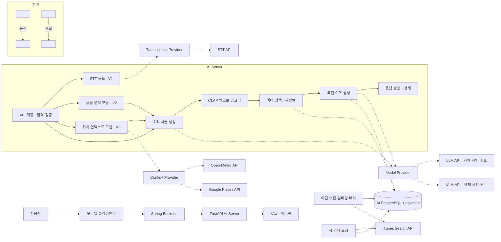
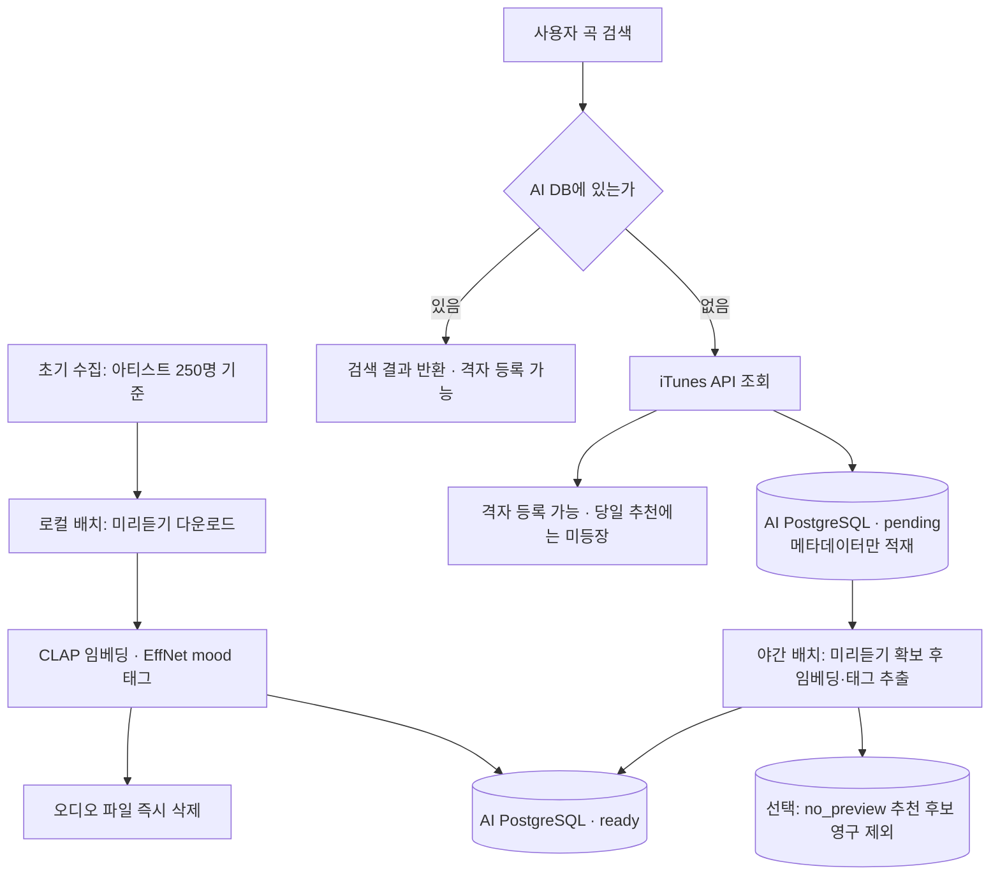
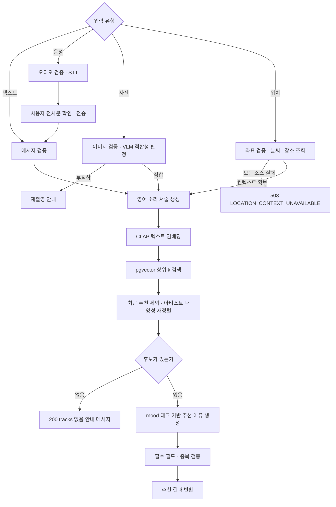

## 1. 최종 설계 범위

이 문서는 단계 1~7에서 확정한 설계를 하나의 서비스 아키텍처로 연결한 최종 통합본이다. 입력 처리, 곡 검색, 코퍼스 수명주기, 외부 API, 데이터 소유권, 배포와 관측 기준을 같은 흐름에서 설명한다.

머문음의 AI 서비스는 사용자 상황을 텍스트, 음성, 사진 또는 위치로 입력받아 실제 제공되는 음악을 추천한다.

제품 범위 | 주요 기능 | 상태
-- | -- | --
V1 | 텍스트 음악 추천, 음성 전사 | MVP 구현 범위
V2 | 풍경 사진 기반 음악 추천 | 확장 설계
V3 | 위치·날씨·장소 기반 음악 추천 | 확장 설계

API 경로의 `/v1`은 제품 출시 단계가 아니라 API 계약 버전을 의미한다.

여기서 설계 완료와 구현·운영 검증 완료는 구분한다. API 계약, 모듈 경계, 코퍼스 구성 방식과 검색 방식은 확정했고 단계 5의 코퍼스 실험은 실제로 측정했다. 반면 전체 요청 지연과 요청당 비용, LLM이 생성한 소리 서술의 품질, V2·V3 경로의 동작, 부하 시험 결과는 아직 측정되지 않았다. 측정하지 않은 성과는 임의의 수치로 제시하지 않는다.

---

## 2. 최종 서비스 아키텍처

### 2.1 구조도

### 2.2 요청과 데이터의 흐름

Spring Backend가 사용자 인증과 권한을 확인한 뒤 AI 서버로 요청을 전달한다. 모바일 클라이언트는 AI 서버를 직접 호출하지 않는다. AI 서버는 무상태이며, 회원·대화·추천 기록·격자 저장은 Spring의 MySQL이 소유한다. AI는 곡 메타데이터·CLAP 벡터·mood 태그를 담은 전용 PostgreSQL을 소유한다.

추천 요청은 입력 유형과 무관하게 같은 경로로 수렴한다. 텍스트·음성은 확정된 한국어 문장에서, 사진은 VLM의 풍경 분석 결과에서, 위치는 날씨·주변 장소 컨텍스트에서 각각 영어 소리 서술을 만든 뒤, CLAP 텍스트 인코더로 질의 벡터를 만들고 pgvector로 상위 후보를 검색한다. 검색 결과에서 최근 추천과 중복을 제외해 재정렬하고, 선정된 곡의 mood 태그와 메타데이터를 LLM 입력에 보강해 한국어 추천 이유를 생성한다.

LLM은 검색 이전의 소리 서술 변환과 검색 이후의 이유 생성만 담당한다. 반환되는 곡은 AI PostgreSQL에 실재하는 `track_id`뿐이므로 존재하지 않는 곡이 사용자에게 노출되는 경로가 구조적으로 존재하지 않는다.

음성 입력은 전사 초안만 반환한다. 사용자가 채팅 입력창에서 확인·수정해 전송한 텍스트가 별도의 추천 요청으로 들어온다. 사진 입력은 제출 화면에서 기술 검증과 추천 적합성 판정을 먼저 수행하고, 적합 판정 이후 생성된 소리 서술로 검색을 진행한다.

### 2.3 곡 코퍼스 수명주기

추천 품질은 코퍼스가 무엇으로 구성되어 있는지에 직접 의존하므로, 수집은 1회성 작업이 아니라 상시 운영되는 파이프라인이다.

사용자가 지도에 등록할 곡을 검색할 때 AI DB에 없는 곡이면 iTunes를 호출한다. 이때 사용자는 그 곡을 즉시 격자에 등록할 수 있지만, 벡터가 없으므로 당일 추천 후보에는 등장하지 않는다. 해당 곡은 메타데이터만 먼저 적재되고 야간 배치에서 임베딩과 mood 태그를 얻은 뒤 추천 후보로 편입된다.

상태 | 의미 | 추천 후보
-- | -- | --
`embedded` | 벡터와 mood 태그 완비 | 포함
`pending` | 메타데이터만 적재, 배치 대기 | 제외
`no_preview` | 미리듣기가 없어 임베딩 불가 | 영구 제외
`failed` | 다운로드·인코딩 실패, 재시도 대상 | 제외

`track_id`를 기본키로 사용하므로 중복 예약은 자동으로 제거된다. 상태 값과 재시도 횟수는 초기안이며 배치 운영 후 조정한다. 오디오 파일은 임베딩 추출 직후 삭제하고 저장하지 않는다.

### 2.4 구성요소별 도입 이유와 효과

구성요소 | 도입 이유 | 기대 효과와 명시적 한계
-- | -- | --
Spring / AI 서버 분리 | 인증·서비스 데이터와 추론 책임을 분리 | 모델·파이프라인 변경이 풀스택 작업을 멈추지 않음. 대신 계약 변경 시 양쪽 합의 필요
FastAPI + Pydantic | 입력·외부 출력·응답 계약을 같은 계층에서 검증 | 잘못된 입력이 모델 호출 비용으로 이어지지 않음
LangGraph 추천 워크플로 | 단계 이름과 실행 경계를 코드로 고정 | 단계별 지연·실패 지점 구분. 단계 계측은 별도 구현이 필요
CLAP + pgvector 벡터 검색 | 자연어와 오디오를 같은 공간에서 비교 | 유효 곡 비율이 구조적으로 100%, 검증 계층 불필요. 코퍼스에 없는 곡은 추천할 수 없음
영어 소리 서술 변환 단계 | CLAP 텍스트 인코더가 영어 전용이며 장면 서술은 신호가 약함 | 파일럿에서 유사도 1.1~2.5배 개선. 변환 품질이 추천 품질을 직접 좌우하는 단일 지점이 됨
mood 태그 기반 이유 생성 | 확정된 곡을 설명하는 데만 LLM 사용 | 없는 곡을 언급할 여지 없음. 태그 품질이 낮으면 설명이 일반적으로 흐를 수 있음
AI PostgreSQL 원본 / Spring MySQL 서비스 데이터 | 수집·검색 책임과 사용자 트랜잭션 책임 분리 | 교차 쓰기 방지. 최근 추천·격자 저장 정보는 계약으로 전달해야 함
야간 수집·임베딩 배치 | 온라인 경로에서 오디오 처리를 제거 | 서빙에 오디오 런타임 불필요. 신곡은 최대 1일 지연 후 추천 가능
Provider Adapter | LLM·STT·VLM·날씨·장소·음악 공급자를 인터페이스 뒤에 격리 | 공급자 교체가 REST 계약에 영향을 주지 않음. 부하 테스트 Mock도 같은 구조로 해결
무상태 Docker 컨테이너 | 초기 트래픽이 검증되지 않은 상태에서 고정비 최소화 | 확장 시 코드 변경 불필요. 단일 인스턴스에서는 프로세스 메모리 캐시 적중률이 분할되지 않음
REST + Adapter (MCP 미도입) | 고정된 소수 도구를 한 서버가 호출하는 현재 범위 | 추가 서버·권한 관리 없음. 도구 재사용 요구가 생기면 재검토

---

## 3. 전체 요청 흐름

입력 처리 방식은 다르지만 소리 서술 이후의 검색·재정렬·이유 생성·응답 검증은 공통 모듈을 사용한다.

---

## 4. 단계별 설계 적용 결과

단계 | 주요 결정과 변경 | 확보한 효과 | 현재 확인 상태
-- | -- | -- | --
1. 모델 API 설계 | 기능별 REST 계약, 공통 추천 응답과 오류 코드 체계 정의 | 풀스택과 AI의 책임 경계 확정, 입력 오류·장애·빈 결과를 구분 | 계약 설계 완료
2. 모델 추론 성능 최적화 | 외부 API 기준선 측정 후 최적화, 기법별 자원·평가지표 정리 | 응답 시간과 비용을 수치로 관리 | 기법 정리 완료. 기준선 실측 미완료
3. 서비스 아키텍처 모듈화 | API·워크플로·Provider 분리, 내부 표준 스키마 고정 | 모델과 외부 API 변경 영향 축소 | 논리 구조 설계 완료. 초기에는 단일 배포 단위
4. 멀티스텝 파이프라인 | 입력별 전처리와 공통 추천 그래프 분리, 실패 지점별 처리 정의 | 존재하지 않는 곡 반환 가능성 감소, 입력 유형이 늘어도 후속 단계를 재사용 | 설계 완료. 단계 5 결과에 맞춘 후보 확보 단계 수정 필요
5. 데이터·컨텍스트 보강 | 태그 비교 대신 CLAP 벡터 검색 채택, 아티스트 기반 코퍼스 4,937곡 구축 | 할루시네이션 제거와 검증 계층 삭제, 허브 현상 해소 | 파일럿 실측 완료. LLM 생성 소리 서술 품질은 미검증
6. 외부 도구 통합 | Provider Adapter, 배치와 온라인 호출 분리, MCP 미도입 | 공급자 종속성·비용·장애를 어댑터로 격리 | 설계 완료. 음원 이용 조건과 운영 키 검증 필요
7. 인프라·확장성·모니터링 | 무상태 단일 컨테이너, 지표 기반 확장 트리거, 부하 시나리오 정의 | 확장 시점의 판단 근거를 CPU가 아닌 지연·동시성으로 확보 | 측정 설계 완료. 배치·DB 구성 요소 반영과 실측 미완료

각 단계의 자세한 근거와 결과는 해당 Wiki 페이지에 연결한다.

---

## 5. 주요 설계 결정

### 5.1 모델이 곡을 생성하지 않는다

추천 결과는 AI PostgreSQL에 실재하는 곡에서만 나온다. LLM이 곡명을 생성하는 방식은 존재하지 않는 곡을 반환할 수 있고 이를 걸러낼 검증 계층이 별도로 필요하지만, 벡터 검색은 DB의 `track_id`만 반환하므로 그 계층 자체가 불필요하다. 유효 곡 비율과 미리듣기 제공률은 품질 지표가 아니라 회귀 감시 지표가 된다.

### 5.2 소리 서술 변환을 별도 단계로 둔다

CLAP 텍스트 인코더는 영어 전용이며, 장면을 그대로 서술한 질의는 파일럿에서 노이즈 수준의 유사도를 보였다. 따라서 모든 입력은 "어떤 장면인가"가 아니라 "어떤 소리가 어울리는가"를 영어로 서술한 문장으로 변환한 뒤 검색에 사용한다. 내부 검색 필드는 `sound_description`으로 통일하고, 사용자에게 노출되는 추천 이유는 한국어로 분리한다.

### 5.3 추천 이유는 확정된 곡의 태그로 생성한다

검색이 끝난 뒤, 선정된 곡의 mood 태그와 메타데이터를 LLM 입력에 추가해 설명을 만든다. 검색 결과로 모델 입력을 보강하는 구조이므로 RAG에 해당하지만, LLM은 후보 집합 밖의 곡을 언급할 수 없도록 제약한다. mood 태그는 배치에서 미리 추출해 저장하므로 서빙 시점에 오디오를 다시 받지 않는다.

### 5.4 음성 입력은 사용자 확인을 거친다

STT 결과를 바로 추천에 사용하지 않는다. 전사문을 채팅 입력창에 초안으로 표시하고, 사용자가 수정·확정한 텍스트만 추천 요청으로 전달한다. 인식 오류가 잘못된 추천으로 직접 이어지지 않도록 하기 위한 경계다.

### 5.5 사진은 제출 화면에서 판정한다

이미지 형식·크기·손상 여부를 확인하고, 한 번의 VLM 호출로 추천 적합성 판정과 소리 서술 생성을 함께 수행한다. 판정은 제출 화면에서 끝나므로 부적합한 사진은 검색 단계로 넘어가지 않는다. 소리 서술이 만들어진 이후 검색 결과가 없는 경우는 장애가 아니므로 `200`과 빈 `tracks`로 반환한다. 기술적으로 처리할 수 없는 이미지와 추천에 적합하지 않은 사진, 결과가 없는 경우를 각각 다른 응답으로 구분한다.

### 5.6 외부 공급자를 분리한다

워크플로가 특정 LLM·STT·VLM SDK를 직접 호출하지 않도록 Provider Adapter를 둔다. 공급자를 변경해도 서비스 API 계약을 유지하며, 부하 테스트의 Mock 모드도 같은 인터페이스로 구현한다.

### 5.7 점진적으로 확장한다

초기에는 Docker 기반의 단일 컨테이너로 시작한다. 확장 판단 기준은 CPU 사용률이 아니라 동시 처리 요청 수와 엔드포인트별 p95이며, 실제 한계는 인스턴스보다 요청당 모델 호출 비용에서 먼저 온다고 본다.

---

## 6. 성능 및 품질 평가

### 평가 환경

| 항목 | 값 |
|---|---|
| 평가 일자 | `[측정 후 입력]` |
| AI 서버 사양 | `[측정 후 입력]` |
| 사용 모델 | `[측정 후 입력]` |
| 테스트 요청 수 | `[측정 후 입력]` |
| 동시 사용자 수 | `[측정 후 입력]` |

### 성능 지표

| 지표 | V1 결과 | 목표 | 판단 |
|---|---:|---:|---|
| 텍스트 추천 p50 | `[측정 후 입력]` | `[목표 입력]` | `[판단 입력]` |
| 텍스트 추천 p95 | `[측정 후 입력]` | `[목표 입력]` | `[판단 입력]` |
| STT p95 | `[측정 후 입력]` | `[목표 입력]` | `[판단 입력]` |
| 오류율 | `[측정 후 입력]` | `[목표 입력]` | `[판단 입력]` |
| 요청당 비용 | `[측정 후 입력]` | `[목표 입력]` | `[판단 입력]` |

### 추천 품질 지표

| 지표 | 결과 | 측정 방법 |
|---|---:|---|
| 응답 스키마 준수율 | `[측정 후 입력]` | 자동 검증 |
| iTunes 실제 곡 조회 성공률 | `[측정 후 입력]` | 후보 대비 조회 성공 수 |
| 추천 적합성 | `[측정 후 입력]` | 팀 평가표 또는 사용자 평가 |
| 중복 추천 비율 | `[측정 후 입력]` | 동일 요청군 결과 비교 |
| 빈 추천 비율 | `[측정 후 입력]` | `tracks=[]` 응답 집계 |

구현 전 기대값을 실제 결과처럼 작성하지 않는다. 모든 결과에는 모델, 프롬프트, 데이터와 서버 조건을 함께 기록한다.

---

## 7. 현재 아키텍처의 강점과 약점

### 강점

- 존재하지 않는 곡이 사용자에게 노출되는 경로가 구조적으로 없다. 검색이 DB의 `track_id`만 반환하므로 곡 실존 검증 계층 자체가 필요 없다.
- 입력 방식이 늘어도 경로가 하나로 유지된다. 텍스트·음성·사진·위치는 소리 서술을 만드는 앞단만 다르고 검색·재정렬·이유 생성·응답 정제는 같은 모듈을 쓴다.
- 추천마다 iTunes를 호출하지 않으므로 외부 음악 API의 지연과 호출 한도가 추천 응답 시간에 직접 영향을 주지 않는다.
- 품질 문제를 "검색이 잘못 골랐는가"와 "설명이 어색한가"로 분리해 관측할 수 있다. 원인 구간이 섞이지 않는다.
- 오디오를 저장하지 않고 임베딩만 남기므로 스토리지·대역폭 요구가 사실상 없고, 벡터와 태그를 합쳐도 20,000곡 기준 수십 MB 수준이다.
- Provider Adapter 덕분에 모델·공급자 교체와 부하 테스트 Mock이 같은 구조로 해결된다.
- 무상태 컨테이너라 확장 시점의 작업이 로드밸런서 구성과 캐시 위치 조정으로 제한된다.

### 약점과 위험

- 코퍼스에 없는 곡은 추천할 수 없다. 추천 품질의 상한이 코퍼스 구성에 직접 묶여 있으며, 문서 작성 시점 현재 규모는 약 15,000곡이다.
- 소리 서술 변환이 단일 실패 지점이다. 이 프롬프트의 품질이 추천 품질을 직접 좌우하는데, 검증은 수작업 문장으로만 이루어졌고 LLM 생성 문장으로는 아직 재현되지 않았다.
- 사용자 유입 곡은 등록 시점부터 최대 하루 동안 추천 후보에 들어오지 못한다. 미리듣기가 없는 곡은 임베딩을 만들 수 없어 영구히 제외된다.
- 야간 배치가 실패하면 조용히 누락된다. 배치 실패 알림과 재처리 경로가 아직 설계되지 않았다.
- iTunes 분당 약 20콜 제한을 곡 검색 경로와 배치가 공유한다. 같은 출구 IP를 쓰면 배치 시간대에 사용자 검색이 영향을 받을 수 있다.
- 미리듣기 음원의 분석·파생 데이터 보관에 대한 이용 조건이 아직 확인되지 않았다. 단계 5의 수집·삭제 기록은 실험 수행 사실이지 이용 허가가 아니다.
- 사용자 행동으로 추천 품질을 확인할 수 없다. 좋아요·싫어요를 수집하지 않으므로 품질 평가가 전적으로 고정 평가 세트와 내부 블라인드 평가에 의존한다.
- 단일 인스턴스·단일 워커 구성이므로 지속적인 높은 유입은 감당할 수 없다. 프로세스 메모리 캐시는 인스턴스가 늘어나는 순간 적중률이 분할된다.

---

## 8. 프로젝트 회고

### 8.1 배운 점

**"좋은 모델"보다 "무엇을 검색하는가"가 먼저였다.** 초기에는 추천 품질을 LLM 성능 문제로 보고 프롬프트와 모델 크기를 조정할 계획이었다. 그러나 파일럿에서 품질을 실제로 가른 것은 코퍼스 구성이었다. 키워드 검색으로 수집한 대량 유통 배경음악이 임베딩 공간 중앙에 자리 잡고 모든 애매한 질의를 흡수했다. 수집 방식을 아티스트 식별자 기반으로 바꾸자 이 현상이 사라졌다. 모델을 건드리지 않고 데이터만 바꿔서 얻은 개선이다.

**질의의 언어와 서술 방식이 검색 성능을 지배했다.** 같은 상황을 장면으로 서술했을 때와 소리로 서술했을 때 유사도가 최대 3배 차이 났다. 더 극단적으로, 의미가 정반대인 한국어 문장 두 개의 유사도가 0.912였다. 모델이 한국어를 부정확하게 처리하는 것이 아니라 모든 한국어 입력을 사실상 같은 좌표로 축약한다는 뜻이었다. 사용자 언어와 검색 질의 언어를 분리해야 한다는 결론은 이 측정에서 나왔다.

**할루시네이션은 막는 것보다 발생할 자리를 없애는 편이 쌌다.** 처음에는 LLM이 생성한 곡을 iTunes로 검증하는 구조였다. 검증 계층, 재시도 정책, 매칭 실패 시 후보 보충까지 필요했다. 검색이 곡을 선정하는 구조로 바꾸자 이 계층이 통째로 사라졌다. 문제를 잘 처리하는 것과 문제가 생기지 않는 구조를 만드는 것은 다른 일이었다.

**측정이 설계를 실제로 되돌렸다.** 태그 기반 비교, 키워드 기반 수집, LLM 곡 생성은 모두 문서에 적혀 있던 계획이었고 실측 후 폐기했다. "측정 후 판단한다"는 원칙은 도입을 미루기 위한 표현이 아니라, 이미 내린 결정을 뒤집는 데도 적용되어야 의미가 있다는 것을 확인했다.

**외부 API의 문서와 실제 동작은 달랐다.** KR 스토어 조회가 0건이고, `offset`이 동작하지 않으며, `artistTerm`이 퍼지 매칭으로 LISA를 다른 아티스트에 연결하는 것은 모두 직접 호출해 보고서야 알았다. 외부 의존성은 조사 단계에서 끝내지 말고 최소 호출이라도 실행해 확인해야 한다.

### 8.2 어려웠던 점

어려움 | 대응 | 남은 한계
-- | -- | --
"RAG를 붙이면 좋아지는가"를 사전에 판단할 수 없었음 | 음악 추천은 정답이 하나가 아니므로 문서 기반 QA처럼 정확도로 판정할 수 없다고 보고, 파이프라인 전 구간을 250곡 규모로 먼저 구현해 실측 | 자동 생성된 소리 서술로는 아직 재현하지 않음
특정 곡이 질의와 무관하게 반복 등장 | 수집 방식을 키워드에서 아티스트 식별자 기반으로 전환하고 중심화 보정 적용 | 표본을 늘려 허브 반복 등장 여부를 추가 확인해야 함
한국어 질의가 내용과 무관하게 같은 결과를 반환 | 사용자 입력은 한국어로 받고 검색 질의만 영어로 생성하도록 단계 분리 | 변환 프롬프트 품질이 검증되지 않은 단일 실패 지점
신규 곡을 언제 추천 가능하게 만들지 | 즉시 임베딩 대신 메타데이터 선적재 후 야간 배치로 분리. 등록과 추천 가능 시점을 다르게 정의 | 배치 실패 알림·재처리 경로 미설계

### 8.3 변경한 결정

처음 결정 | 변경 후 | 변경 근거
-- | -- | --
음악 특성 태그를 비교해 추천 | CLAP 임베딩 벡터 검색 | 저차원 태그는 수천 곡을 같은 값으로 뭉개 순위 산출 해상도가 부족. Spotify도 audio-features를 추천 엔진 주 재료로 쓰지 않았고, iTunes는 해당 필드를 제공하지 않음
LLM이 곡 후보 생성 후 iTunes 검증 | 벡터 검색이 곡을 선정, LLM은 이유만 생성 | 검색 결과가 곧 최종 산출물이므로 생성 단계를 둘 이유가 없고, 검증 계층을 제거할 수 있음
장르 키워드로 곡 수집 | 아티스트 식별자 기반 수집 | 키워드 검색은 결과 품질 통제 불가, 쿼리당 200곡 상한, 허브 현상 유발
RAG는 데이터 확보 후 도입 검토 | 추천 이유 생성에 RAG 적용, 추천 생성에는 미적용 | 검색 대상이 외부 문서가 아니라 자체 구축 벡터이므로 주입 지점이 다름
수집은 1회성 로컬 배치 | 사용자 검색 기반 상시 수집 + 야간 배치 | 사용자가 등록하려는 곡이 코퍼스에 없는 경우가 정상 경로로 존재
GPU 플랫폼 후보 미정 | RunPod | 모델 비교·양자화 실험 환경을 빠르게 구성할 수 있고, 현재 GPU 용도가 운영 서빙이 아니라 실험과 배치이기 때문

---

## 9. 향후 개선 계획

우선순위 | 개선 항목 | 실행 내용 | 완료 판단 기준
-- | -- | -- | --
1 | 소리 서술 자동 생성 검증 | 수작업 문장으로 얻은 변환 효과를 LLM 생성 문장으로 재현. 유사도 상승과 주관 적합도 개선을 분리 측정 | 고정 평가 세트에서 수작업 대비 유사도·적합도 동등 이상
2 | 고정 평가 세트 30개 작성 | 감정·장면·활동·제약·후속 요청·개인화 범주로 문안 작성, 원문과 변환본을 함께 보관 | 20개 개선용 / 10개 최종 확인용 분리 완료, 재현 비교 가능
3 | 전체 경로 지연·비용 실측 | CLAP 텍스트 인코딩, 벡터 검색, LLM 호출을 구간별로 분해 측정 | p50·p95와 요청당 비용 확보, 월 예산으로 처리 가능한 요청 수 산출
4 | AI PostgreSQL 스키마 확정 | 곡 상태 값, 인덱스 구성, 벡터·태그 버전 관리 규칙 정의 | 동일 원천 재수집 시 중복 0건, 서로 다른 버전 벡터가 섞이지 않음
5 | 야간 배치 운영화 | 실행 환경 결정, 실패 재처리, iTunes 호출 한도 내 처리량 확인, 실패 알림 | 중단 후 재실행 시 부분 반영 없이 복구, 하루 처리 가능 곡 수 확보
6 | 음원 이용 조건 확인 | 미리듣기 분석과 파생 데이터 보관의 허용 범위 확인 또는 분석 가능한 음원 출처 확보 | 확인 결과를 문서화하고, 불가 시 대체 경로 결정
7 | 부하 시험 수행 | Mock·실호출 두 모드로 피크 6 RPS와 그 2·4배까지 측정, 전사 혼합 부하 포함 | 응답 시간이 급격히 증가하는 지점과 병목 자원 식별
8 | V2·V3 경로 검증 | 적합·부적합 사진 판정 정확도, 위치 소스 부분 실패 시나리오 각각 검증 | 판정 정확도와 부분 실패 동작이 설계대로 재현됨
9 | 관측 대시보드 구현 | 서비스 개요·파이프라인 단계·외부 의존성과 비용·컨테이너 네 화면 구성 | 단계별 지연 분해와 일일 누적 비용을 대시보드에서 확인 가능

협업 필터링, 오픈웨이트 모델 자체 서빙, 수평 확장과 Kubernetes는 초기 필수 구성으로 넣지 않는다. 새로운 기술은 일정에 따라 자동으로 도입하지 않는다. 현재 구조의 한계가 측정으로 확인되고, 해당 기술이 그 한계를 해결한다는 근거가 있을 때 평가 세트와 비용 기준을 만든 뒤 도입한다. 

---

## 10. 최종 결론

머문음의 AI 서빙 구조는 하나의 원칙으로 설명된다. 지금 근거로 확인된 것만 구조에 고정하고, 확인되지 않은 것은 교체 가능한 자리에 둔다.

첫째, 책임 경계가 계약으로 고정되어 있다. 모바일은 AI 서버를 직접 호출하지 않고, 인증과 서비스 데이터는 Spring이, 입력 검증과 추천 생성은 AI 서버가 맡는다. 두 파트는 REST 계약만 공유하므로 AI 내부의 모델과 파이프라인이 바뀌어도 풀스택 쪽 작업이 멈추지 않는다.

둘째, 입력 방식이 늘어도 경로는 하나로 유지된다. 텍스트, 음성, 사진, 위치는 소리 서술을 만드는 앞단만 다르고 검색과 이유 생성, 응답 정제는 같은 모듈을 쓴다. V2와 V3에서 추가되는 것은 전처리 모듈과 외부 컨텍스트 소스이며, 추천 응답 형식과 모바일 구현은 그대로 재사용된다.

셋째, 곡은 모델이 만들어내지 않는다. 사용자에게 반환되는 곡은 코퍼스에 실재하는 곡뿐이고, 모델은 검색 이전의 질의 변환과 검색 이후의 설명만 담당한다. 존재하지 않는 곡이 노출되는 실패 모드가 구조적으로 차단되며, 품질 문제를 검색 문제와 설명 문제로 나누어 볼 수 있다.

넷째, 도입 판단 기준이 모든 단계에서 동일하다. 오픈웨이트 자체 서빙, 협업 필터링, Kubernetes, MCP, 마이크로서비스 분리는 모두 보류하거나 조건부로 두었고, 조건은 예외 없이 현재 구조의 실패가 측정으로 확인되었을 때다. 이 원칙은 선언에 그치지 않았다. 태그 기반 비교, 키워드 기반 수집, LLM 곡 생성은 모두 문서에 적혀 있던 계획이었고 실측 후 폐기했다. 측정이 설계를 실제로 되돌린 이력이 있다는 점이 이 구조를 신뢰할 근거다.

다섯째, 확장 시점의 판단 근거를 미리 확보했다. AI 서버는 무상태 컨테이너이므로 인스턴스를 늘리는 데 코드 변경이 필요하지 않고, 확장 트리거는 CPU 사용률이 아니라 동시 처리 요청 수와 p95로 정의했다. 동시에 실제 한계가 인스턴스가 아니라 요청당 모델 호출 비용에서 먼저 온다는 점도 명시했다.

따라서 이 아키텍처는 현재 규모의 구현을 시작하기 위한 타당한 기준선이다. 다만 운영 준비 완료를 의미하지는 않는다. 자동 생성된 소리 서술의 품질 검증, 전체 경로 지연과 요청당 비용 실측, 음원 이용 조건 확인, 야간 배치의 운영 검증과 부하 시험을 통과해야 출시 아키텍처로 승인할 수 있다.
